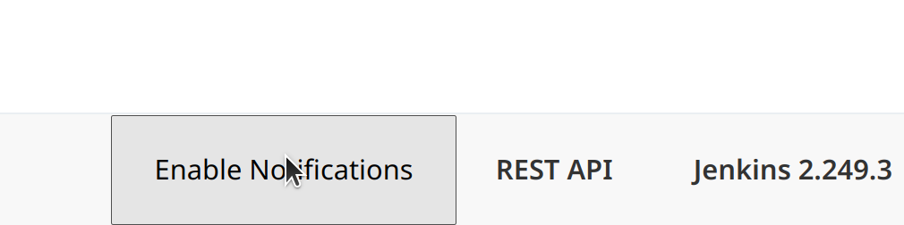
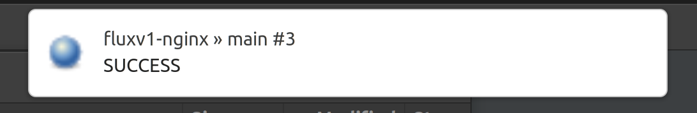

# gitops-playground
[](https://oss.cloudogu.com/jenkins/blue/organizations/jenkins/cloudogu-github%2Fgitops-playground/)

Reproducible infrastructure to showcase GitOps workflows with Kubernetes.

In fact, this rolls out a complete DevOps stack with different features including 
* GitOps (with different controllers to choose from: Argo CD, Flux v1 and v2),
* Monitoring (using Prometheus and Grafana),
* example applications and CI-pipelines (using Jenkins and our [GitOps library](https://github.com/cloudogu/gitops-build-lib)) and
* soon Secrets management (using Vault).

The gitops-playground is derived from our experiences in [consulting](https://cloudogu.com/en/consulting/?mtm_campaign=gitops-playground&mtm_kwd=consulting&mtm_source=github&mtm_medium=link) 
and operating the [myCloudogu platform](https://my.cloudogu.com/).  
For questions or suggestions you are welcome to join us at our myCloudogu [community forum](https://community.cloudogu.com/t/introducing-the-gitops-playground/107).

[](https://community.cloudogu.com/t/introducing-the-gitops-playground/107)

# TLDR;

You can run a local k8s cluster with the GitOps playground installed with only one command (on Linux)

```shell
docker pull ghcr.io/cloudogu/gitops-playground && \ 
bash <(curl -s \
  https://raw.githubusercontent.com/cloudogu/gitops-playground/main/scripts/init-cluster.sh) \
  && sleep 2 && docker run --rm -it -u $(id -u) -v ~/.k3d/kubeconfig-gitops-playground.yaml:/home/.kube/config \
    --net=host \
    ghcr.io/cloudogu/gitops-playground --yes
```

This command will also print URLs of the [applications](#applications) inside the cluster to get you started.  
Note that you can append `--argocd`, `--fluxv1` and `--fluxv2` to select specific operators. This will also speed up the 
progress.

We recommend running this command as an unprivileged user, that is inside the [docker group](https://docs.docker.com/engine/install/linux-postinstall/#manage-docker-as-a-non-root-user). 

# Table of contents

<!-- Update with `doctoc --notitle README.md.md --maxlevel 4`. See https://github.com/thlorenz/doctoc -->
<!-- START doctoc generated TOC please keep comment here to allow auto update -->
<!-- DON'T EDIT THIS SECTION, INSTEAD RE-RUN doctoc TO UPDATE -->

- [What is the GitOps Playground?](#what-is-the-gitops-playground)
- [Installation](#installation)
  - [Create Cluster](#create-cluster)
  - [Apply playground](#apply-playground)
    - [Apply via Docker (local cluster)](#apply-via-docker-local-cluster)
    - [Apply via kubectl (remote cluster)](#apply-via-kubectl-remote-cluster)
    - [Additional parameters](#additional-parameters)
  - [Remove playground](#remove-playground)
- [Applications](#applications)
  - [Credentials](#credentials)
  - [Jenkins](#jenkins)
  - [SCM-Manager](#scm-manager)
  - [Monitoring tools](#monitoring-tools)
  - [Argo CD UI](#argo-cd-ui)
  - [Demo applications](#demo-applications)
    - [Flux V1](#flux-v1)
    - [Flux V2](#flux-v2)
    - [Argo CD](#argo-cd)
- [Development](#development)

<!-- END doctoc generated TOC please keep comment here to allow auto update -->

## What is the GitOps Playground?

The GitOps Playground provides an reproducible environment for trying out GitOps. Is consists of Infra As Code and 
scripts for automatically setting up a Kubernetes Cluster including CI-server (Jenkins), source code management 
(SCM-Manager) and several GitOps operators (Flux V1, Flux V2, Argo CD). 
CI-Server, SCM and operators are pre-configured with a number of [demo applications](#demo-applications).

The GitOps Playground lowers the barriers for getting your hands on GitOps. No need to read lots of books and operator
docs, getting familiar with CLIs, ponder about GitOps Repository folder structures and staging, etc.
The GitOps Playground is a pre-configured environment to see GitOps in motion, including more advanced use cases like 
notifications and monitoring.

## Installation

There a several options for running the GitOps playground

* on a local k3d cluster  
  __NOTE: Currently runs only on linux!__  
  Running on Windows or Mac is possible in general, but we would need to bind all needed ports to k3d container.  
  See our [POC](https://github.com/cloudogu/gitops-playground/commit/d11f1cf77cc58fdc2b768202f9447eab31770f75). 
  Let us know if this feature is of interest to you.
* on a remote k8s cluster
* each with the option 
  * to use an external Jenkins, SCM-Manager and registry 
    (this can be run in production, e.g. with a [Cloudogu Ecosystem](https://cloudogu.com/en/ecosystem/?mtm_campaign=gitops-playground&mtm_kwd=ces&mtm_source=github&mtm_medium=link)) or  
  * to run everything inside the cluster (for demo only)  

The diagrams below show an overview of the playground's architecture and three scenarios for running the playground. 

Note that running Jenkins inside the cluster is meant for demo purposes only. The third graphic shows our production 
scenario with the Cloudogu EcoSystem (CES). Here better security and build performance is achieved using ephemeral 
Jenkins build agents spawned in the cloud.

| Demo on local machine | Demo on remote cluster | Production environment with CES |
|--------------------|--------------------|--------------------|
| |   |  |

### Create Cluster

If you don't have a demo cluster at hand we provide scripts to create either 

* a local k3d cluster (see [docs](docs/k3d.md) or [script](scripts/init-cluster.sh) for more details):
  ```shell
  bash <(curl -s \
    https://raw.githubusercontent.com/cloudogu/gitops-playground/main/scripts/init-cluster.sh)
  ```
* a remote k8s cluster on Google Kubernetes Engine (e.g. via Terraform, see our [docs](docs/gke.md)),
* or almost any k8s cluster.  
  Note that if you want to deploy Jenkins inside the cluster, Docker is required as container runtime.

### Apply playground

You can apply the playground to your cluster using our container image `ghcr.io/cloudogu/gitops-playground`.  
On success, the container prints a little intro on how to get started with the GitOps playground.

There are several options for running the container: 

* For local k3d cluster, we recommend running the image as a local container via `docker`  
* For remote clusters (e.g. on GKE) you can run the image inside a pod of the target cluster via `kubectl`. 

All options offer the same parameters, see [below](#additional-parameters).

#### Apply via Docker (local cluster)

When connecting to k3d it is easiest to apply the playground via a local container in the host network and pass
k3d's kubeconfig.

```shell
CLUSTER_NAME=gitops-playground
docker pull ghcr.io/cloudogu/gitops-playground
docker run --rm -it -u $(id -u)  -v ~/.k3d/kubeconfig-${CLUSTER_NAME}.yaml:/home/.kube/config \
  --net=host \
  ghcr.io/cloudogu/gitops-playground # additional parameters go here
``` 

Note: 
* `docker pull` in advance makes sure you have the newest image, even if you ran this command before.  
  Of course, you could also specify a specific [version of the image](https://github.com/cloudogu/gitops-playground/pkgs/container/gitops-playground/versions).
* Using the host network makes it possible to determine `localhost` and to use k3d's kubeconfig without altering, as it 
access the API server via a port bound to localhost.
* We run as the local user in order to avoid file permission issues with the `kubeconfig-${CLUSTER_NAME}.yaml.`
* If you experience issues and want to access the full log files, use the following command while the container is running:

```bash
docker exec -it \
  $(docker ps -q  --filter ancestor=ghcr.io/cloudogu/gitops-playground) \
  bash -c -- 'tail -f  -n +1 /tmp/playground-log-*'
```

#### Apply via kubectl (remote cluster)

For remote clusters it is easiest to apply the playground via kubectl.
You can find info on how to install kubectl [here](https://v1-21.docs.kubernetes.io/docs/tasks/tools/#kubectl).

```shell
# Create a temporary ServiceAccount and authorize via RBAC. This is needed to install CRDs, etc.
kubectl create serviceaccount gitops-playground-job-executer -n default
kubectl create clusterrolebinding gitops-playground-job-executer \
  --clusterrole=cluster-admin \
  --serviceaccount=default:gitops-playground-job-executer

# Then start apply the playground with the following command
# The --remote parameter exposes Jenkins, SCMM and argo on well-known ports for example, 
# so you don't have to remember the individual ports
kubectl run gitops-playground -i --tty --restart=Never \
  --overrides='{ "spec": { "serviceAccount": "gitops-playground-job-executer" } }' \
  --image ghcr.io/cloudogu/gitops-playground \
  -- --yes --remote # additional parameters go here

# If everything succeeded, remove the objects
kubectl delete clusterrolebinding/gitops-playground-job-executer \
  sa/gitops-playground-job-executer pods/gitops-playground -n default  
```

In general `docker run` should work here as well. But GKE, for example, uses gcloud and python in their kubeconfig.
Running inside the cluster avoids these kinds of issues.

#### Additional parameters

The following describes more parameters and use cases.

You can get a full list of all options like so:

```shell
docker run --rm ghcr.io/cloudogu/gitops-playground --help
```

##### Deploy specific GitOps operators only

* `--argocd` - deploy only Argo CD GitOps operator
* `--fluxv1` - deploy only Flux v1 GitOps operator
* `--fluxv2` - deploy only Flux v2 GitOps operator

##### Deploy with local Cloudogu Ecosystem

See our [Quickstart Guide](https://cloudogu.com/en/ecosystem/quick-start-guide/?mtm_campaign=gitops-playground&mtm_kwd=ces&mtm_source=github&mtm_medium=link) on how to set up the instance.  
Then set the following parameters.

```shell
# Note: 
# * In this case --password only sets the Argo CD admin password (Jenkins and SCMM are external)
# * Insecure is needed, because the local instance will not have a valid cert
--jenkins-url=https://192.168.56.2/jenkins \ 
--scmm-url=https://192.168.56.2/scm \
--jenkins-username=admin \
--jenkins-password=yourpassword \
--scmm-username=admin \
--scmm-password=yourpassword \
--password=yourpassword \
--insecure
```

##### Deploy with productive Cloudogu Ecosystem and GCR

Using Google Container Registry (GCR) fits well with our cluster creation example via Terraform on Google Kubernetes Engine 
(GKE), see our [docs](docs/gke.md).

Note that you can get a free CES demo instance set up with a Kubernetes Cluster as GitOps Playground 
[here](https://cloudogu.com/en/ecosystem/demo-appointment/?mtm_campaign=gitops-playground&mtm_kwd=ces&mtm_source=github&mtm_medium=link).

```shell
# Note:
# In this case --password only sets the Argo CD admin password (Jenkins and SCMM are external) 
--jenkins-url=https://your-ecosystem.cloudogu.net/jenkins \ 
--scmm-url=https://your-ecosystem.cloudogu.net/scm \
--jenkins-username=admin \
--jenkins-password=yourpassword \
--scmm-username=admin \
--scmm-password=yourpassword \
--password=yourpassword \
--registry-url=eu.gcr.io \
--registry-path=yourproject \
--registry-username=_json_key \ 
--registry-password="$( cat account.json | sed 's/"/\\"/g' )" 
```

##### Override default images used in the gitops-build-lib

Images used by the gitops-build-lib are set in the `gitopsConfig` in each `Jenkinsfile` of an application like that:

```
def gitopsConfig = [
    ...
    buildImages          : [
            helm: 'ghcr.io/cloudogu/helm:3.5.4-1',
            kubectl: 'lachlanevenson/k8s-kubectl:v1.19.3',
            kubeval: 'ghcr.io/cloudogu/helm:3.5.4-1',
            helmKubeval: 'ghcr.io/cloudogu/helm:3.5.4-1',
            yamllint: 'cytopia/yamllint:1.25-0.7'
    ],...
```

To override each image in all the applications you can use following parameters:

* `--kubectl-image someRegistry/someImage:1.0.0`
* `--helm-image someRegistry/someImage:1.0.0`
* `--kubeval-image someRegistry/someImage:1.0.0`
* `--helmkubeval-image someRegistry/someImage:1.0.0`
* `--yamllint-image someRegistry/someImage:1.0.0`

##### Argo CD-Notifications

If you are using a remote cluster you can set the `--argocd-url` parameter so that argocd-notification messages have a
link to the corresponding application.

##### Metrics

Set the parameter `--metrics` to enable deployment of monitoring and alerting tools like prometheus, grafana and mailhog.

See [Monitoring tools](#monitoring-tools) for details.

### Remove playground

For k3d, you can just `k3d cluster delete gitops-playground`. This will delete the whole cluster. If you just want to 
remove the playground from the cluster, use this [script](scripts/destroy.sh): './scripts/destroy.sh'

On remote clusters there is a [script](scripts/destroy.sh) inside this repo:

```shell
bash <(curl -s \
  https://raw.githubusercontent.com/cloudogu/gitops-playground/main/scripts/destroy.sh) 
```

## Applications

As described [above](#what-is-the-gitops-playground) the GitOps playground comes with a number of applications. Some of
them can be accessed via web.
* Jenkins
* SCM-Manager
* Argo CD
* Demo applications for each GitOps operator, each with staging and production instance.

We distilled the logic used in the example application pipelines into a reusable library for Jenkins:
[cloudogu/gitops-build-lib](https://github.com/cloudogu/gitops-build-lib).

The URLs of the applications depend on the environment the playground is deployed to.
The following lists all application and how to find out their respective URLs for a GitOps playground being deployed to
local or remote cluster.

For remote clusters you need the external IP, no need to specify the port (everything running on port 80).
Basically, you can get the IP address as follows:

```shell
kubectl -n "${namespace}" get svc "${serviceName}" \
  --template="{{range .status.loadBalancer.ingress}}{{.ip}}{{end}}"
```

There is also a convenience script `scripts/get-remote-url`. The script waits, if externalIP is not present, yet.
You could use this conveniently like so:
```shell
bash <(curl -s \
  https://raw.githubusercontent.com/cloudogu/gitops-playground/main/scripts/get-remote-url) \
  jenkins default
```

You can open the application in the browser right away, like so for example:

```shell
xdg-open $(bash <(curl -s \
  https://raw.githubusercontent.com/cloudogu/gitops-playground/main/scripts/get-remote-url) \
   jenkins default)
```
### Credentials

If deployed within the cluster, Jenkins, SCM-Manager, Argo CD and others can be accessed via: `admin/admin`

Note that you can change (an should for a remote cluster!) the password with the `--password` argument.
There also is a `--username` parameter, which is ignored for argocd. That is, for now argos username ist always `admin`.

### Jenkins

Jenkins is available at

* http://localhost:9090 (k3d)
* `scripts/get-remote-url jenkins default` (remote k8s) 

You can enable browser notifications about build results via a button in the lower right corner of Jenkins Web UI.

Note that this only works when using `localhost` or `https://`. 





###### External Jenkins

You can set an external jenkins server via the following parameters when applying the playground.
See [Parameters](#additional-parameters) for examples.

* `--jenkins-url`, 
* `--jenkins-username`, 
* `--jenkins-password`

Note that the [demo applications](#demo-applications) pipelines will only run on a Jenkins that uses agents that provide
a docker host. That is, Jenkins must be able to run e.g. `docker ps` successfully on the agent. 

The user has to have the following privileges: 
* install plugins
* set credentials
* create jobs
* restarting

### SCM-Manager

SCM-Manager is available at

* http://localhost:9091 (k3d)
* `scripts/get-remote-url scmm-scm-manager default` (remote k8s)

###### External SCM-Manager

You can set an external SCM-Manager via the following parameters when applying the playground. 
See [Parameters](#additional-parameters) for examples.

* `--scmm-url`,
* `--scmm-username`,
* `--scmm-password`

The user on the scm has to have privileges to:
* add / edit users
* add / edit permissions
* add / edit repositories
* add / edit proxy
* install plugins

### Monitoring tools

Set the parameter `--metrics` so the [kube-prometheus-stack](https://github.com/prometheus-operator/kube-prometheus)
via its [helm-chart](https://github.com/prometheus-community/helm-charts/tree/main/charts/kube-prometheus-stack)
is being deployed including Argo CD dashboards. 

This leads to the following tools to be exposed:

* Mailhog
  * http://localhost:9094 (k3d)
  * `scripts/get-remote-url mailhog monitoring` (remote k8s)
* Grafana 
  * http://localhost:9095 (k3d)
  * `scripts/get-remote-url kube-prometheus-stack-grafana monitoring` (remote k8s)

Grafana can be used to query and visualize metrics via prometheus.
Prometheus is not exposed by default.

In addition, argocd-notifications is set up. Applications deployed with Argo CD now will alert via email to mailhog 
the sync status failed, for example.

**Note that this only works with Argo CD so far**

### Argo CD UI

Argo CD's web UI is available at

* http://localhost:9092 (k3d)
* `scripts/get-remote-url argocd-server argocd` (remote k8s)

### Demo applications

Each GitOps operator comes with a couple of demo applications that allow for experimenting with different GitOps 
features.

All applications are deployed via separated application and GitOps repos: 


* Separation of app repo and GitOps repo
* Infrastructure as Code is maintained  in app repo,
* CI Server writes to GitOps repo and creates PullRequests.

The applications implement a simple staging mechanism:

* After a successful Jenkins build, the staging application will be deployed into the cluster by the GitOps operator.
* Deployment of production applications can be triggered by accepting pull requests.

Note that we are working on moving the GitOps-related logic into a
[gitops-build-lib](https://github.com/cloudogu/gitops-build-lib) for Jenkins. See the README there for more options like
* staging,
* resource creation,
* validation (fail early / shift left).

Please note that it might take about a minute after the pull request has been accepted for the GitOps operator to start
deploying.
Alternatively you can trigger the deployment via the respective GitOps operator's CLI (flux) or UI (Argo CD)

#### Flux V1

##### PetClinic with plain k8s resources 

[Jenkinsfile](applications/petclinic/fluxv1/plain-k8s/Jenkinsfile) for plain `k8s` deployment

* Staging: 
  * local: [localhost:30001](http://localhost:30001) 
  * remote: `scripts/get-remote-url spring-petclinic-plain fluxv1-staging`
* Production:  
  * local: [localhost:30002](http://localhost:30002)
  * remote: `scripts/get-remote-url spring-petclinic-plain fluxv1-production`
* QA (example for a 3rd stage)
  * local: [localhost:30003](http://localhost:30003) 
  * remote: `scripts/get-remote-url spring-petclinic-plain fluxv1-qa`

##### PetClinic with helm

[Jenkinsfile](applications/petclinic/fluxv1/helm/Jenkinsfile) for `helm` deployment

* Staging
  * local: [localhost:30004](http://localhost:30004)
  * remote: `scripts/get-remote-url spring-petclinic-helm-springboot fluxv1-staging`
* Production
  * local: [localhost:30005](http://localhost:30005) 
  * remote: `scripts/get-remote-url spring-petclinic-helm-springboot fluxv1-production`

##### 3rd Party app (NGINX) with helm

[Jenkinsfile](applications/nginx/fluxv1/Jenkinsfile)

* Staging
  * local: [localhost:30006](http://localhost:30006)
  * remote: `scripts/get-remote-url nginx fluxv1-staging`
* Production
  * local: [localhost:30007](http://localhost:30007)
  * remote: `scripts/get-remote-url nginx fluxv1-production`

#### Flux V2

##### PetClinic with plain k8s resources 

[Jenkinsfile](applications/petclinic/fluxv2/plain-k8s/Jenkinsfile)

* Staging
  * local: [localhost:30010](http://localhost:30010)
  * remote: `scripts/get-remote-url spring-petclinic-plain fluxv2-staging`
* Production
  * local: [localhost:30011](http://localhost:30011) 
  * remote: `scripts/get-remote-url spring-petclinic-plain fluxv2-production`

#### Argo CD

##### PetClinic with plain k8s resources

[Jenkinsfile](applications/petclinic/argocd/plain-k8s/Jenkinsfile) for `plain` deployment

* Staging
  * local [localhost:30020](http://localhost:30020)
  * remote: `scripts/get-remote-url spring-petclinic-plain argocd-staging`
* Production
  * local [localhost:30021](http://localhost:30021)
  * remote: `scripts/get-remote-url spring-petclinic-plain argocd-production`

##### PetClinic with helm

[Jenkinsfile](applications/petclinic/argocd/helm/Jenkinsfile) for `helm` deployment

* Staging
  * local [localhost:30022](http://localhost:30022)
  * remote: `scripts/get-remote-url spring-petclinic-helm argocd-staging`
* Production
  * local [localhost:30023](http://localhost:30023)
  * remote: `scripts/get-remote-url spring-petclinic-helm argocd-production`

##### 3rd Party app (NGINX) with helm

[Jenkinsfile](applications/nginx/argocd/Jenkinsfile)

* Staging
  * local: [localhost:30006](http://localhost:30024)
  * remote: `scripts/get-remote-url nginx fluxv1-staging`
* Production
  * local: [localhost:30007](http://localhost:30025)
  * remote: `scripts/get-remote-url nginx fluxv1-production`

## Development

See [docs/developers.md](docs/developers.md)