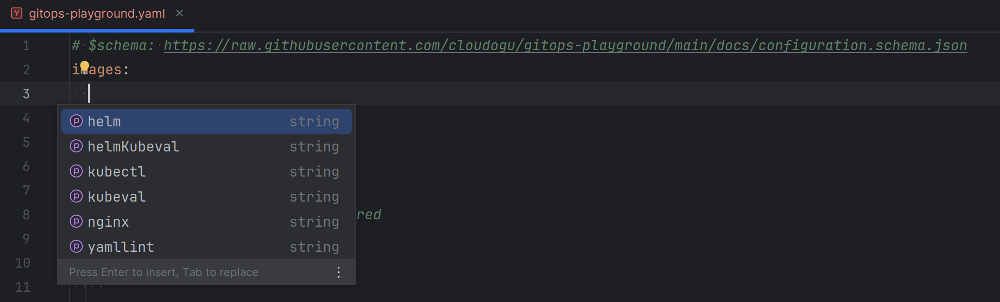

# gitops-playground

Creates a complete GitOps-based operational stack on your Kubernetes clusters:

* Deployment: GitOps via Argo CD with a ready-to-use [repo structure](#argocd)
* Monitoring: [Prometheus and Grafana](#monitoring-tools)
* Secrets Management:  [Vault and External Secrets Operator](#secrets-management-tools)
* Notifications/Alerts: Grafana and ArgoCD can be predefined with either an external mailserver or [MailHog](https://github.com/mailhog/MailHog) for demo purposes.
* Pipelines: Example applications using [Jenkins](#jenkins) with the [gitops-build-lib](https://github.com/cloudogu/gitops-build-lib) and [SCM-Manager](#scm-manager)
* Ingress Controller: [ingress-nginx](https://github.com/kubernetes/ingress-nginx/)
* Certificate Management: (planned)
* Runs on: 
  * local cluster (try it [with only one command](#tldr)), 
  * in the public cloud, 
  * and even air-gapped environments (work in progress).

The gitops-playground is derived from our experiences in [consulting](https://cloudogu.com/en/consulting/?mtm_campaign=gitops-playground&mtm_kwd=consulting&mtm_source=github&mtm_medium=link),
operating the [myCloudogu platform](https://my.cloudogu.com/) and is used in our [GitOps trainings for both Flux and ArgoCD](https://platform.cloudogu.com/en/trainings/gitops-continuous-operations/?mtm_campaign=gitops-playground&mtm_kwd=training&mtm_source=github&mtm_medium=link).  


## TL;DR

You can try the GitOps Playground on a local Kubernetes cluster by running a single command:

```shell
bash <(curl -s \
  https://raw.githubusercontent.com/cloudogu/gitops-playground/main/scripts/init-cluster.sh) --bind-ingress-port=80 \
  && docker run --rm -t --pull=always -u $(id -u) \
    -v ~/.config/k3d/kubeconfig-gitops-playground.yaml:/home/.kube/config \
    --net=host \
    ghcr.io/cloudogu/gitops-playground --yes --argocd --ingress-nginx --base-url=http://localhost
# If you want to try all features, you might want to add these params: --mail --monitoring --vault=dev
```

Note that on some linux distros like debian do not support subdomains of localhost.
There you might have to use `--base-url=http://local.gd` (see [local ingresses](#local-ingresses)).

See the list of [applications](#applications) to get started.

We recommend running this command as an unprivileged user, that is inside the [docker group](https://docs.docker.com/engine/install/linux-postinstall/#manage-docker-as-a-non-root-user).

## Table of contents

<!-- Update with `doctoc --notitle README.md --maxlevel 5`. See https://github.com/thlorenz/doctoc -->
<!-- START doctoc generated TOC please keep comment here to allow auto update -->
<!-- DON'T EDIT THIS SECTION, INSTEAD RE-RUN doctoc TO UPDATE -->

- [What is the GitOps Playground?](#what-is-the-gitops-playground)
- [Installation](#installation)
  - [Overview](#overview)
  - [Create Cluster](#create-cluster)
  - [Apply playground](#apply-playground)
    - [Apply via Docker (local cluster)](#apply-via-docker-local-cluster)
    - [Apply via kubectl (remote cluster)](#apply-via-kubectl-remote-cluster)
    - [Additional parameters](#additional-parameters)
      - [Configuration file](#configuration-file)
      - [Deploy Ingress Controller](#deploy-ingress-controller)
      - [Deploy Ingresses](#deploy-ingresses)
      - [Deploy GitOps operators](#deploy-gitops-operators)
      - [Deploy with local Cloudogu Ecosystem](#deploy-with-local-cloudogu-ecosystem)
      - [Deploy with productive Cloudogu Ecosystem and GCR](#deploy-with-productive-cloudogu-ecosystem-and-gcr)
      - [Override default images](#override-default-images)
      - [Argo CD-Notifications](#argo-cd-notifications)
      - [Monitoring](#monitoring)
      - [Mail server](#mail-server)
      - [MailHog](#mailhog)
      - [External Mailserver](#external-mailserver)
      - [Secrets Management](#secrets-management)
  - [Remove playground](#remove-playground)
  - [Running on Windows or Mac](#running-on-windows-or-mac)
    - [Mac and Windows WSL](#mac-and-windows-wsl)
    - [Windows Docker Desktop](#windows-docker-desktop)
- [Stack](#stack)
  - [Credentials](#credentials)
  - [Argo CD](#argo-cd)
    - [Why not use argocd-autopilot?](#why-not-use-argocd-autopilot)
    - [cluster-resources](#cluster-resources)
  - [Jenkins](#jenkins)
  - [SCM-Manager](#scm-manager)
  - [Monitoring tools](#monitoring-tools)
  - [Secrets Management Tools](#secrets-management-tools)
    - [dev mode](#dev-mode)
    - [prod mode](#prod-mode)
    - [Example app](#example-app)
  - [Example Applications](#example-applications)
    - [PetClinic with plain k8s resources](#petclinic-with-plain-k8s-resources)
    - [PetClinic with helm](#petclinic-with-helm)
    - [3rd Party app (NGINX) with helm, templated in Jenkins](#3rd-party-app-nginx-with-helm-templated-in-jenkins)
    - [3rd Party app (NGINX) with helm, using Helm dependency mechanism](#3rd-party-app-nginx-with-helm-using-helm-dependency-mechanism)
- [Development](#development)

<!-- END doctoc generated TOC please keep comment here to allow auto update -->

## What is the GitOps Playground?

The GitOps Playground provides a reproducible environment for setting up a GitOps-Stack.
It provides an image for automatically setting up a Kubernetes Cluster including CI-server (Jenkins),
source code management (SCM-Manager), Monitoring and Alerting (Prometheus, Grafana, MailHog), Secrets Management (Hashicorp
Vault and External Secrets Operator) and of course Argo CD as GitOps operator.

The playground also deploys a number of [example applications](#example-applications).

The GitOps Playground lowers the barriers for operating your application on Kubernetes using GitOps.
It creates a complete GitOps-based operational stack on your Kubernetes clusters.
No need to read lots of books and operator
docs, getting familiar with CLIs, ponder about GitOps Repository folder structures and promotion to different environments, etc.  
The GitOps Playground is a pre-configured environment to see GitOps in motion, including more advanced use cases like
notifications, monitoring and secret management.

In addition to creating an operational stack in production, you can run the playground locally, for learning and developing new features. 

We aim to be compatible with various environments, e.g. OpenShift and in an air-gapped network.
The support for these is *work in progress*.

## Installation

There a several options for running the GitOps playground

* on a local k3d cluster
  Works best on Linux, but is possible on [Windows and Mac](#windows-or-mac). 
* on a remote k8s cluster
* each with the option
    * to use an external Jenkins, SCM-Manager and registry
      (this can be run in production, e.g. with a [Cloudogu Ecosystem](https://cloudogu.com/en/ecosystem/?mtm_campaign=gitops-playground&mtm_kwd=ces&mtm_source=github&mtm_medium=link)) or
    * to run everything inside the cluster (for demo only)

The diagrams below show an overview of the playground's architecture and three scenarios for running the playground.
For a simpler overview including all optional features such as monitoring and secrets management see intro at the very top.

Note that running Jenkins inside the cluster is meant for demo purposes only. The third graphic shows our production
scenario with the Cloudogu EcoSystem (CES). Here better security and build performance is achieved using ephemeral
Jenkins build agents spawned in the cloud.

### Overview
| Playground on local machine                                             | Production environment with Cloudogu EcoSystem                                                                                                                                                        |
|-------------------------------------------------------------------------|-------------------------------------------------------------------------------------------------------------------------------------------------------------------------------------------------------|
|  |  |

### Create Cluster

You can apply the GitOps playground to 

* a local k3d cluster (see [docs](docs/k3d.md) or [script](scripts/init-cluster.sh) for more details):
  ```shell
  bash <(curl -s \
    https://raw.githubusercontent.com/cloudogu/gitops-playground/main/scripts/init-cluster.sh)
  ```
* a remote k8s cluster on Google Kubernetes Engine (e.g. via Terraform, see our [docs](docs/gke.md)),
* or almost any k8s cluster.  
  Note that if you want to deploy Jenkins inside the cluster, you either need Docker as container runtime or set Jenkins up to run its build on an agent that provides Docker.

### Apply playground

You can apply the playground to your cluster using our container image `ghcr.io/cloudogu/gitops-playground`.  
On success, the container prints a little intro on how to get started with the GitOps playground.

There are several options for running the container:

* For local k3d cluster, we recommend running the image as a local container via `docker`
* For remote clusters (e.g. on GKE) you can run the image inside a pod of the target cluster via `kubectl`.

All options offer the same parameters, see [below](#additional-parameters).

#### Apply via Docker (local cluster)

When connecting to k3d it is easiest to apply the playground via a local container in the host network and pass
k3d's kubeconfig.

```shell
CLUSTER_NAME=gitops-playground
docker pull ghcr.io/cloudogu/gitops-playground
docker run --rm -t -u $(id -u) \
  -v ~/.config/k3d/kubeconfig-${CLUSTER_NAME}.yaml:/home/.kube/config \
  --net=host \
  ghcr.io/cloudogu/gitops-playground # additional parameters go here
``` 

Note:
* `docker pull` in advance makes sure you have the newest image, even if you ran this command before.  
  Of course, you could also specify a specific [version of the image](https://github.com/cloudogu/gitops-playground/pkgs/container/gitops-playground/versions).
* Using the host network makes it possible to determine `localhost` and to use k3d's kubeconfig without altering, as it
  access the API server via a port bound to localhost.
* We run as the local user in order to avoid file permission issues with the `kubeconfig-${CLUSTER_NAME}.yaml.`
* If you experience issues and want to access the full log files, use the following command while the container is running:

```bash
docker exec -it \
  $(docker ps -q  --filter ancestor=ghcr.io/cloudogu/gitops-playground) \
  bash -c -- 'tail -f  -n +1 /tmp/playground-log-*'
```

#### Apply via kubectl (remote cluster)

For remote clusters it is easiest to apply the playground via kubectl.
You can find info on how to install kubectl [here](https://v1-25.docs.kubernetes.io/docs/tasks/tools/#kubectl).

```shell
# Create a temporary ServiceAccount and authorize via RBAC.
# This is needed to install CRDs, etc.
kubectl create serviceaccount gitops-playground-job-executer -n default
kubectl create clusterrolebinding gitops-playground-job-executer \
  --clusterrole=cluster-admin \
  --serviceaccount=default:gitops-playground-job-executer

# Then start apply the playground with the following command:
# To access services on remote clusters, add either --remote or --ingress-nginx --base-url=$yourdomain
kubectl run gitops-playground -i --tty --restart=Never \
  --overrides='{ "spec": { "serviceAccount": "gitops-playground-job-executer" } }' \
  --image ghcr.io/cloudogu/gitops-playground \
  -- --yes --argocd # additional parameters go here. 

# If everything succeeded, remove the objects
kubectl delete clusterrolebinding/gitops-playground-job-executer \
  sa/gitops-playground-job-executer pods/gitops-playground -n default  
```

In general `docker run` should work here as well. But GKE, for example, uses gcloud and python in their kubeconfig.
Running inside the cluster avoids these kinds of issues.

#### Additional parameters

The following describes more parameters and use cases.

You can get a full list of all options like so:

```shell
docker run -t --rm ghcr.io/cloudogu/gitops-playground --help
```

##### Configuration file

You can also use a configuration file to specify the parameters (`--config-file` or `--config-map`).
That file must be a YAML file. 

Note that the config file is not yet a complete replacement for CLI parameters.

You can use `--output-config-file` to output the current config as set by defaults and CLI parameters.

In addition, For easier validation and auto-completion, we provide a [schema file](https://raw.githubusercontent.com/cloudogu/gitops-playground/main/docs/configuration.schema.json).

For example in Jetbrains IntelliJ IDEA, you can use the schema for autocompletion and validation when you put the following at the beginning of your config file:

```yaml
# $schema: https://raw.githubusercontent.com/cloudogu/gitops-playground/main/docs/configuration.schema.json
```

If you work with an older version, you can use a specific git commit ID instead of `main` in the schema URL.

Then use the context assistant to enable coding assistance or fill in all available properties.
See [here](https://www.jetbrains.com/help/ruby/yaml.html#use-schema-keyword) for the full manual.



###### Apply via Docker

```bash
docker run --rm -t --pull=always -u $(id -u) \
    -v ~/.config/k3d/kubeconfig-gitops-playground.yaml:/home/.kube/config \
    -v $(pwd)/gitops-playground.yaml:/config/gitops-playground.yaml \
    --net=host \
    ghcr.io/cloudogu/gitops-playground --yes --argocd --config-file=/config/gitops-playground.yaml
```

###### Apply via kubectl

[Create the serviceaccount and clusterrolebinding](#apply-via-kubectl-remote-cluster)

```bash
$ cat config.yaml # for example
features: 
  monitoring:
    active: true

# Convention:
# Find the ConfigMap inside the current namespace for the config map
# From the config map, pick the key "config.yaml"
kubectl create configmap gitops-config --from-file=config.yaml

kubectl run gitops-playground -i --tty --restart=Never \
  --overrides='{ "spec": { "serviceAccount": "gitops-playground-job-executer" } }' \
  --image ghcr.io/cloudogu/gitops-playground \
  -- --yes --argocd --config-map=gitops-config
```

Afterwards, you might want to do a [clean up](#apply-via-kubectl-remote-cluster).
In addition, you might want to delete the config-map as well.

``` bash
kubectl delete cm gitops-config 
```

##### Deploy Ingress Controller

In the default installation the GitOps-Playground comes without an Ingress-Controller.  

We use Nginx as default Ingress-Controller.
It can be enabled via the configfile or parameter `--ingress-nginx`.

In order to make use of the ingress controller, it is recommended to use it in conjunction with [`--base-url`](#deploy-ingresses), which will create `Ingress` objects for all components of the GitOps playground.

The ingress controller is based on the helm chart [`ingress-nginx`](https://kubernetes.github.io/ingress-nginx).

Additional parameters from this chart's values.yaml file can be added to the installation through the gitops-playground [configuration file](#configuration-file).

Example:
```yaml
features:
  ingressNginx:
    active: true
    helm:
      values:
        controller:
          replicaCount: 4
```
In this Example we override the default `controller.replicaCount` (GOP's default is 2).

This config file is merged with precedence over the defaults set by 
* [the GOP](applications/cluster-resources/ingress-nginx-helm-values.ftl.yaml) and
* [the charts itself](https://github.com/kubernetes/ingress-nginx/blob/main/charts/ingress-nginx/values.yaml).

##### Deploy Ingresses

It is possible to deploy `Ingress` objects for all components. You can either 
* Set a common base url (`--base-url=https://example.com`) or
* individual URLS: 
```
--argocd-url https://argocd.example.com 
--grafana-url https://grafana.example.com 
--vault-url https://vault.example.com 
--mailhog-url https://mailhog.example.com 
--petclinic-base-domain petclinic.example.com 
--nginx-base-domain nginx.example.com
```
* or both, where the individual URLs take precedence.

Note: 
* `jenkins-url` and `scmm-url` are for external services and do not lead to ingresses, but you can set them via `--base-url` for now.
* In order to make use of the `Ingress` you need an ingress controller. If your cluster does not provide one, the Playground can deploy one for you, via the [`--ingress-nginx` parameter](#deploy-ingress-controller).

###### Subdomains vs hyphen-separated ingresses

* By default, the ingresses are built as subdomains of `--base-url`.  
* You can change this behaviour using the parameter `--url-separator-hyphen`.  
* With this, hyphen are used instead of dots to separate application name from base URL.
* Examples: 
  * `--base-url=https://xyz.example.org`: `argocd.xyz.example.org` (default)  
  * `--base-url=https://xyz.example.org`: `argocd-xyz.example.org` (`--url-separator-hyphen`)
* This is useful when you have a wildcard certificate for the TLD, but use a subdomain as base URL.  
  Here, browsers accept the validity only for the first level of subdomains.

###### Local ingresses

The ingresses can also be used when running the playground on your local machine:

* Ingresses might be easier to remember than arbitrary port numbers and look better in demos 
* With ingresses, we can execute our [local clusters](docs/k3d.md) in higher isolation or multiple playgrounds concurrently
* Ingresses are required [for running on Windows/Mac](#windows-or-mac).

To use them locally, 
* init your cluster (`init-cluster.sh`) with `--bind-ingress-port`, e.g. `80` or `8080`.
* apply your playground with the following parameters  
  (when using a port other than 80, append `:port`, e.g. `localhost:8080`): 
  * `--base-url=http://localhost` 
    * this is possible on Windows (tested on 11), Mac (tested on Ventura) or when using Linux with [systemd-resolved](https://www.freedesktop.org/software/systemd/man/systemd-resolved.service.html) (default in Ubuntu, not Debian)  
      As an alternative, you could add all `*.localhost` entries to your `hosts` file.  
      Use `kubectl get ingress -A` to get a full list 
    * Then, you can reach argocd on `http://argocd.localhost`, for example
  * `--base-url=http://local.gd` (or `127.0.0.1.nip.io`, `127.0.0.1.sslip.io`, or others)
    * This should work for all other machines that have access to the internet without further config 
    * Then, you can reach argocd on `http://argocd.local.gd`, for example
* Note that when using port 80, the URLs are shorter, but you run into issues because port 80 is regarded as a privileged port. 
  Java applications seem not to be able to reach `localhost:80` or even `127.0.0.1:80` (`NoRouteToHostException`)
* If your setup requires you to bind to a specific interface, you can just pass it with e.g. `--bind-ingress-port=127.0.0.1:80`

##### Deploy GitOps operators

* `--argocd` - deploy Argo CD GitOps operator

> ⚠️ **Note** that switching between operators is not supported.  
That is, expect errors (for example with cluster-resources) if you apply the playground once with Argo CD and the next
time without it. We recommend resetting the cluster with `init-cluster.sh` beforehand.

##### Deploy with local Cloudogu Ecosystem

See our [Quickstart Guide](https://cloudogu.com/en/ecosystem/quick-start-guide/?mtm_campaign=gitops-playground&mtm_kwd=ces&mtm_source=github&mtm_medium=link) on how to set up the instance.  
Then set the following parameters.

```shell
# Note: 
# * In this case --password only sets the Argo CD admin password (Jenkins and 
#    SCMM are external)
# * Insecure is needed, because the local instance will not have a valid cert
--jenkins-url=https://192.168.56.2/jenkins \ 
--scmm-url=https://192.168.56.2/scm \
--jenkins-username=admin \
--jenkins-password=yourpassword \
--scmm-username=admin \
--scmm-password=yourpassword \
--password=yourpassword \
--insecure
```

##### Deploy with productive Cloudogu Ecosystem and GCR

Using Google Container Registry (GCR) fits well with our cluster creation example via Terraform on Google Kubernetes Engine
(GKE), see our [docs](docs/gke.md).

Note that you can get a free CES demo instance set up with a Kubernetes Cluster as GitOps Playground
[here](https://cloudogu.com/en/ecosystem/demo-appointment/?mtm_campaign=gitops-playground&mtm_kwd=ces&mtm_source=github&mtm_medium=link).

```shell
# Note: In this case --password only sets the Argo CD admin password (Jenkins 
# and SCMM are external) 
--jenkins-url=https://your-ecosystem.cloudogu.net/jenkins \ 
--scmm-url=https://your-ecosystem.cloudogu.net/scm \
--jenkins-username=admin \
--jenkins-password=yourpassword \
--scmm-username=admin \
--scmm-password=yourpassword \
--password=yourpassword \
--registry-url=eu.gcr.io \
--registry-path=yourproject \
--registry-username=_json_key \ 
--registry-password="$( cat account.json | sed 's/"/\\"/g' )" 
```

##### Override default images 

###### gitops-build-lib

Images used by the gitops-build-lib are set in the `gitopsConfig` in each `Jenkinsfile` of an application like that:

```
def gitopsConfig = [
    ...
    buildImages          : [
            helm: 'ghcr.io/cloudogu/helm:3.10.3-1',
            kubectl: 'bitnami/kubectl:1.29',
            kubeval: 'ghcr.io/cloudogu/helm:3.10.3-1',
            helmKubeval: 'ghcr.io/cloudogu/helm:3.10.3-1',
            yamllint: 'cytopia/yamllint:1.25-0.7'
    ],...
```

To override each image in all the applications you can use following parameters:

* `--kubectl-image someRegistry/someImage:1.0.0`
* `--helm-image someRegistry/someImage:1.0.0`
* `--kubeval-image someRegistry/someImage:1.0.0`
* `--helmkubeval-image someRegistry/someImage:1.0.0`
* `--yamllint-image someRegistry/someImage:1.0.0`

###### Tools and Exercises

Images used by various tools and exercises can be configured using the following parameters:

* `--grafana-image someRegistry/someImage:1.0.0`
* `--external-secrets-image someRegistry/someImage:1.0.0`
* `--external-secrets-certcontroller-image someRegistry/someImage:1.0.0`
* `--external-secrets-webhook-image someRegistry/someImage:1.0.0`
* `--vault-image someRegistry/someImage:1.0.0`
* `--nginx-image someRegistry/someImage:1.0.0`

Note that specifying a tag is mandatory.  
  
  
  
##### Argo CD-Notifications

If you are using a remote cluster, you can set the `--argocd-url` parameter so that argocd-notification messages have a
link to the corresponding application.

You can specify email addresses for notifications (note that by default, MailHog will not actually send emails)

* `--argocd-email-from`: Sender E-Mail address. Default is `argocd@example.org`)
* `--argocd-email-to-admin`: Alerts send to admin. Default is `infra@example.org`)
* `--argocd-email-to-user`: Alerts send to user. Default is `app-team@example.org`)


##### Monitoring

Set the parameter `--monitoring` to enable deployment of monitoring and alerting tools like prometheus, grafana and mailhog.

See [Monitoring tools](#monitoring-tools) for details.

You can specify email addresses for notifications (note that by default, MailHog will not actually send emails)

* `--grafana-email-from`: Sender E-Mail address. Default is `grafana@example.org`
* `--grafana-email-to`: Recipient E-Mail address. Default is `infra@example.org`

##### Mail server

The gitops-playground uses MailHog to showcase notifications.  
Alternatively, you can configure an external mailserver.

Note that you can't use both at the same time.   
If you set either `--mailhog` or `--mail` parameter, MailHog will be installed  
If you set `--smtp-*` parameters, a external Mailserver will be used and MailHog will not be deployed.

##### MailHog
Set the parameter `--mailhog` to enable MailHog.

This will deploy MailHog and configure Argo CD and Grafana to send mails to MailHog.  
Sender and recipient email addresses can be set via parameters in some applications, e.g. `--grafana-email-from` or `--argocd-email-to-user`.

Parameters:
* `--mailhog`: Activate MailHog as internal Mailserver
* `--mailhog-url`: Specify domain name (ingress) under which MailHog will be served

##### External Mailserver
If you want to use an external Mailserver you can set it with these parameters

* `--smtp-address`: External Mailserver SMTP address or IP
* `--smtp-port`: External Mailserver SMTP port
* `--smtp-user`: External Mailserver login username
* `--smtp-password`: External Mailservers login password. Make sure to put your password in single quotes.

This will configure Argo CD and Grafana to send mails using your external mailserver.  
In addition you should set matching sender and recipient email addresses, e.g. `--grafana-email-from` or `--argocd-email-to-user`.

##### Secrets Management

Set the parameter `--vault=[dev|prod]` to enable deployment of secret management tools hashicorp vault and external
secrets operator.
See [Secrets management tools](#secrets-managment-tools) for details.

### Remove playground

For k3d, you can just `k3d cluster delete gitops-playground`. This will delete the whole cluster.
If you want to delete k3d use `rm .local/bin/k3d`.

To remove the playground without deleting the cluster, use the option `--destroy`.
You need to pass the same parameters when deploying the playground to ensure that the destroy script 
can authenticate with all tools.
Note that this option has limitations. It does not remove CRDs, namespaces, locally deployed SCM-Manager, Jenkins and registry, plugins for SCM-Manager and Jenkins 

### Running on Windows or Mac

* In general: We cannot use the `host` network, so it's easiest to access via [ingress controller](#deploy-ingress-controller) and [ingresses](#local-ingresses).
* `--base-url=http://localhost --ingress-nginx` should work on both Windows and Mac.
* In case of problems resolving e.g. `jenkins.localhost`, you could try using `--base-url=http://local.gd` or similar, as described in [local ingresses](#local-ingresses).

#### Mac and Windows WSL

On macOS and when using the Windows Subsystem Linux on Windows (WSL), you can just run our [TL;DR command](#tldr) after installing Docker.

For Windows, we recommend using [Windows Subsystem for Linux version 2](https://learn.microsoft.com/en-us/windows/wsl/install#install-wsl-command) (WSL2) with a [native installation of Docker Engine](https://docs.docker.com/engine/install/), because it's easier to set up and less prone to errors.

For macOS, please increase the Memory limit in Docker Desktop (for your DockerVM) to be > 10 GB.
Recommendation: 16GB.

```bash
bash <(curl -s \
  https://raw.githubusercontent.com/cloudogu/gitops-playground/main/scripts/init-cluster.sh) --bind-ingress-port=80 \
  && docker run --rm -t --pull=always -u $(id -u) \
    -v ~/.config/k3d/kubeconfig-gitops-playground.yaml:/home/.kube/config \
    --net=host \
    ghcr.io/cloudogu/gitops-playground --yes --argocd --ingress-nginx --base-url=http://localhost
# If you want to try all features, you might want to add these params: --mail --monitoring --vault=dev
```

When you encounter errors with port 80 you might want to use e.g. 
* `--bind-ingress-port=8080` and 
* `--base-url=http://localhost:8080` instead.

#### Windows Docker Desktop

* As mentioned in the previous section, we recommend using WSL2 with a native Docker Engine.
* If you must, you can also run using Docker Desktop from native Windows console (see bellow)
* However, there seems to be a problem when the Jenkins Jobs running the playground access docker, e.g.   
```
$ docker run -t -d -u 0:133 -v ... -e ******** bitnami/kubectl:1.25.4 cat
docker top e69b92070acf3c1d242f4341eb1fa225cc40b98733b0335f7237a01b4425aff3 -eo pid,comm
process apparently never started in /tmp/gitops-playground-jenkins-agent/workspace/xample-apps_petclinic-plain_main/.configRepoTempDir@tmp/durable-7f109066
(running Jenkins temporarily with -Dorg.jenkinsci.plugins.durabletask.BourneShellScript.LAUNCH_DIAGNOSTICS=true might make the problem clearer)
Cannot contact default-1bg7f: java.nio.file.NoSuchFileException: /tmp/gitops-playground-jenkins-agent/workspace/xample-apps_petclinic-plain_main/.configRepoTempDir@tmp/durable-7f109066/output.txt
```
* In Docker Desktop, it's recommended to use WSL2 as backend. 
* Using the Hyper-V backend should also work, but we experienced random `CrashLoopBackoff`s of running pods due to liveness probe timeouts.  
  Same as for macOS, increasing the Memory limit in Docker Desktop (for your DockerVM) to be > 10 GB might help.  
  Recommendation: 16GB.

Here is how you can start the playground from a Windows-native PowerShell console:

* [Install k3d](https://k3d.io/#installation), see [init-cluster.sh](scripts/init-cluster.sh) for `K3D_VERSION`, e.g. using `winget`
```powershell
winget install k3d --version x.y.z
```
* Create k3d cluster.
  See `K3S_VERSION` in [init-cluster.sh](scripts/init-cluster.sh) for `$image`, then execute  
```powershell
$ingress_port = "80"
$registry_port = "30000"
$image = "rancher/k3s:v1.25.5-k3s2"
# Note that ou can query the image version used by playground like so: 
# (Invoke-WebRequest -Uri 'https://raw.githubusercontent.com/cloudogu/gitops-playground/main/scripts/init-cluster.sh').Content -split "`r?`n" | Select-String -Pattern 'K8S_VERSION=|K3S_VERSION='

k3d cluster create gitops-playground `
    --k3s-arg=--kube-apiserver-arg=service-node-port-range=8010-65535@server:0 `
    -p ${ingress_port}:80@server:0:direct `
    -v /var/run/docker.sock:/var/run/docker.sock@server:0 `
    --image=${image} `
    -p ${registry_port}:30000@server:0:direct

# Write $HOME/.config/k3d/kubeconfig-gitops-playground.yaml
k3d kubeconfig write gitops-playground
```
* Note that
  * You can ignore the warning about docker.sock
  * We're mounting the docker socket, so it can be used by the Jenkins Agents for the docker-plugin.
  * Windows seems not to provide a group id for the docker socket. So the Jenkins Agents run as root user.
  * If you prefer running with an unprivileged user, consider running on WSL2, Mac or Linux
  * You could also add `-v gitops-playground-build-cache:/tmp@server:0 ` to persist the Cache of the Jenkins agent between restarts of k3d containers.
* Apply playground:  
  Note that when using a `$registry_port` other than `30000` append the command `--internal-registry-port=$registry_port` bellow
  
```powershell
docker run --rm -t --pull=always `
    -v $HOME/.config/k3d/kubeconfig-gitops-playground.yaml:/home/.kube/config `
    --net=host `
    ghcr.io/cloudogu/gitops-playground --yes --argocd --ingress-nginx --base-url=http://localhost:$ingress_port # more params go here
```

## Stack

As described [above](#what-is-the-gitops-playground) the GitOps playground comes with a number of applications. Some of
them can be accessed via web.
* Jenkins
* SCM-Manager
* Argo CD
* Prometheus/Grafana
* Vault
* Example applications for each GitOps operator, some with staging and production environments.

The URLs of the applications depend on the environment the playground is deployed to.
The following lists all applications and how to find out their respective URLs for a GitOps playground being deployed to
local or remote cluster.

For remote clusters you need the external IP, no need to specify the port (everything running on port 80).
Basically, you can get the IP address as follows:

```shell
kubectl -n "${namespace}" get svc "${serviceName}" \
  --template="{{range .status.loadBalancer.ingress}}{{.ip}}{{end}}"
```

There is also a convenience script `scripts/get-remote-url`. The script waits, if externalIP is not present, yet.
You could use this conveniently like so:
```shell
bash <(curl -s \
  https://raw.githubusercontent.com/cloudogu/gitops-playground/main/scripts/get-remote-url) \
  jenkins default
```

You can open the application in the browser right away, like so for example:

```shell
xdg-open $(bash <(curl -s \
  https://raw.githubusercontent.com/cloudogu/gitops-playground/main/scripts/get-remote-url) \
   jenkins default)
```

### Credentials

If deployed within the cluster, all applications can be accessed via: `admin/admin`

Note that you can change (and should for a remote cluster!) the password with the `--password` argument.
There also is a `--username` parameter, which is ignored for argocd. That is, for now argos username ist always `admin`.

### Argo CD

Argo CD's web UI is available at

* http://localhost:9092 (k3d)
* `scripts/get-remote-url argocd-server argocd` (remote k8s)
* `--argocd-url` to specify domain name

Argo CD is installed in a production-ready way, that allows for operating Argo CD with Argo CD, using GitOps and
providing a [repo per team pattern](https://github.com/cloudogu/gitops-patterns/tree/8e1056f#repo-per-team).

When installing the GitOps playground, the following steps are performed to bootstrap Argo CD:

* The following repos are created and initialized:
    * `argocd` (management and config of Argo CD itself),
    * `example-apps` (example for a developer/application team's GitOps repo) and
    * `cluster-resources` (example for a cluster admin or infra/platform team's repo; see below for details)
* Argo CD is installed imperatively via a helm chart.
* Two resources are applied imperatively to the cluster: an `AppProject` called `argocd` and an `Application` called
  `bootstrap`. These are also contained within the `argocd` repository.

From there everything is managed via GitOps. This diagram shows how it works.


1. The `bootstrap` application manages the folder `applications`, which also contains `bootstrap` itself.  
   With this, changes to the `bootstrap` application can be done via GitOps. The `bootstrap` application also deploys
   other apps ([App Of Apps pattern](https://github.com/argoproj/argo-cd/blob/v2.7.1/docs/operator-manual/cluster-bootstrapping.md?plain=1))
2. The `argocd` application manages the folder `argocd` which contains Argo CD's resources as an umbrella helm chart.  
   The [umbrella chart pattern](https://github.com/helm/helm-www/blob/d2543/content/en/docs/howto/charts_tips_and_tricks.md#complex-charts-with-many-dependencies)
   allows describing the actual values in `values.yaml` and deploying additional resources (such as secrets and
   ingresses) via the `templates` folder. The actual ArgoCD chart is declared in the `Chart.yaml`
3. The `Chart.yaml` contains the Argo CD helm chart as `dependency`. It points to a deterministic version of the Chart
   (pinned via `Chart.lock`) that is pulled from the Chart repository on the internet.  
   This mechanism can be used to upgrade Argo CD via GitOps. See the [Readme of the argocd repository](argocd/argocd/README.md)
   for details.
4. The `projects` application manages the `projects` folder, that contains the following `AppProjects`:
    * the `argocd` project, used for bootstrapping
    * the built-in `default` project (which is restricted to [eliminate threats to security](https://github.com/argoproj/argo-cd/blob/ce8825ad569bf961178606acc5f3842532148093/docs/threat_model.pdf))
    * one project per team (to implement least privilege and also notifications per team):
        * `cluster-resources` (for platform admin, needs more access to cluster) and
        * `example-apps` (for developers, needs less access to cluster)
5. The `cluster-resources` application points to the `cluster-resources` git repository (`argocd` folder), which
   has the typical folder structure of a GitOps repository (explained in the next step). This way, the platform admins
   use GitOps in the same way as their "customers" (the developers) and can provide better support.
6. The `example-apps` application points to the `example-apps` git repository (`argocd` folder again). Like the
   `cluster-resources`, it also has the typical folder structure of a GitOps repository:
    * `apps` - contains the kubernetes resources of all applications (the actual YAML)
    * `argocd` - contains Argo CD `Applications` that point to subfolders of `apps` (App Of Apps pattern, again)
    * `misc` - contains kubernetes resources, that do not belong to specific applications (namespaces, RBAC,
      resources used by multiple apps, etc.)
7. The `misc` application points to the `misc` folder
8. The `my-app-staging` application points to the `apps/my-app/staging` folder within the same repo. This provides a
   folder structure for release promotion. The `my-app-*` applications implement the [Environment per App Pattern](https://github.com/cloudogu/gitops-patterns/tree/8e1056f#global-vs-env-per-app).
   This pattern allows each application to have its own environments, e.g. production and staging or none at all.
   Note that the actual YAML here could either be pushed manually or using the CI server.
   The [applications](#example-applications) contain examples that push config changes from the app repo to the GitOps
   repo using the CI server. This implementation mixes the [Repo per Team and Repo per App patterns](https://github.com/cloudogu/gitops-patterns/tree/8e1056f#repository-structure)
9. The corresponding production environment is realizing using the `my-app-production` application, that points to the
   `apps/my-app/production` folder within the same repo.  
   Note that it is recommended to protect the `production` folders from manual access, if supported by the SCM of your choice.  
   Alternatively, instead of different YAMLs files as used in the diagram, these applications could be realized as
    * Two applications in the same YAML (implemented in the playground, see e.g. [`petclinic-plain.yaml`](argocd/example-apps/argocd/petclinic-plain.ftl.yaml))
    * Two application with the same name in different namespaces, when ArgoCD is enabled to search for applications
      within different namespaces (implemented in the playground, see
      [Argo CD's values.yaml](argocd/argocd/argocd/values.ftl.yaml) - `application.namespaces` setting)
    * One `ApplicationSet`, using the [`git` generator for directories](https://github.com/argoproj/argo-cd/blob/v2.7.1/docs/operator-manual/applicationset/Generators-Git.md#git-generator-directories)
      (not used in GitOps playground, yet)

To keep things simpler, the GitOps playground only uses one kubernetes cluster, effectively implementing the [Standalone](https://github.com/cloudogu/gitops-patterns/tree/8e1056f#standalone)
pattern. However, the repo structure could also be used to serve multiple clusters, in a [Hub and Spoke](https://github.com/cloudogu/gitops-patterns/tree/8e1056f#hub-and-spoke) pattern:
Additional clusters could either be defined in the `vaules.yaml` or as secrets via the `templates` folder.

We're also working on an optional implementation of the [namespaced](https://github.com/cloudogu/gitops-patterns/tree/8e1056f#namespaced) pattern, using the [Argo CD operator](https://github.com/argoproj-labs/argocd-operator).

#### Why not use argocd-autopilot?

And advanced question: Why does the GitOps playground not use the [**argocd-autopilot**](https://github.com/argoproj-labs/argocd-autopilot)?

The short answer is: As of 2023-05, version 0.4.15 it looks far from ready for production.

Here is a diagram that shows how the repo structure created by autopilot looks like:


Here are some thoughts why we deem it not a good fit for production:

* The version of ArgoCD is not pinned.
    * Instead, the `kustomization.yaml` (3️ in the diagram) points to a `base` within the autopilot repo, which in turn
      points to the `stable` branch of the Argo CD repo.
    * While it might be possible to pin the version using Kustomize, this is not the default and looks complicated.
    * A non-deterministic version calls for trouble. Upgrades of Argo CD might happen unnoticed.
    * What about breaking changes? What about disaster recovery?
* The repository structure autopilot creates is more complicated (i.e. difficult to understand and maintain) than
  the one used in the playground
    * Why is the `autopilot-bootstrap` application (1️ in the diagram) not within the GitOps repo and lives only in the
      cluster?
    * The approach of an `ApplicationSet` within the `AppProject`'s yaml pointing to a `config.json` (more difficult to
      write than YAML) is difficult to grasp (4️ and 6️ in the diagram)
    * The `cluster-resources` `ApplicationSet` is a good approach to multi-cluster but again, requires writing JSON
      (4️ in the diagram).
* Projects are used to realize environments (6️ and 7️ in the diagram).  
  How would we separate teams in this [monorepo structure](https://github.com/cloudogu/gitops-patterns/tree/789d300#repository-structure)?  
  One idea would be to use multiple Argo CD instances, realising a [Standalone pattern](https://github.com/cloudogu/gitops-patterns/tree/789d30055443b6096d9018ca13cbd4234a24cc3d#operator-deployment).
  This would mean that every team would have to manage its own ArgoCD instance.  
  How could this task be delegated to a dedicated platform team? These are the questions that lead to the structure
  realized in the GitOps playground.

#### cluster-resources

The playground installs cluster-resources (like prometheus, grafana, vault, external secrets operator, etc.) via the repo  
`argocd/cluster-resources`. See [ADR](docs/architecture-decision-records.md#deploying-cluster-resources-with-argo-cd-using-inline-yaml) for more details.

When installing without Argo CD, the tools are installed using helm imperatively, we fall back to using imperative 
helm installation as a kind of neutral ground.

### Jenkins

Jenkins is available at

* http://localhost:9090 (k3d)
* `scripts/get-remote-url jenkins default` (remote k8s)

You can enable browser notifications about build results via a button in the lower right corner of Jenkins Web UI.

Note that this only works when using `localhost` or `https://`.


###### External Jenkins

You can set an external jenkins server via the following parameters when applying the playground.
See [parameters](#additional-parameters) for examples.

* `--jenkins-url`,
* `--jenkins-username`,
* `--jenkins-password`

Note that the [example applications](#example-applications) pipelines will only run on a Jenkins that uses agents that provide
a docker host. That is, Jenkins must be able to run e.g. `docker ps` successfully on the agent.

The user has to have the following privileges:
* install plugins
* set credentials
* create jobs
* restarting

### SCM-Manager

SCM-Manager is available at

* http://localhost:9091 (k3d)
* `scripts/get-remote-url scmm-scm-manager default` (remote k8s)

###### External SCM-Manager

You can set an external SCM-Manager via the following parameters when applying the playground.
See [Parameters](#additional-parameters) for examples.

* `--scmm-url`,
* `--scmm-username`,
* `--scmm-password`

The user on the scm has to have privileges to:
* add / edit users
* add / edit permissions
* add / edit repositories
* add / edit proxy
* install plugins

### Monitoring tools

Set the parameter `--monitoring` so the [kube-prometheus-stack](https://github.com/prometheus-operator/kube-prometheus)
via its [helm-chart](https://github.com/prometheus-community/helm-charts/tree/main/charts/kube-prometheus-stack)
is being deployed including Argo CD dashboards.

This leads to the following tools to be exposed:

* Mailhog
    * http://localhost:9094 (k3d)
    * `scripts/get-remote-url mailhog monitoring` (remote k8s)
    * `--mailhog-url` to specify domain name
* Grafana
    * http://localhost:9095 (k3d)
    * `scripts/get-remote-url kube-prometheus-stack-grafana monitoring` (remote k8s)
    * `--grafana-url` to specify domain name

Grafana can be used to query and visualize metrics via prometheus.
Prometheus is not exposed by default.

In addition, argocd-notifications is set up. Applications deployed with Argo CD now will alert via email to mailhog
the sync status failed, for example.

**Note that this only works with Argo CD so far**

### Secrets Management Tools

Via the `vault` parameter, you can deploy Hashicorp Vault and the External Secrets Operator into your GitOps playground.

With this, the whole flow from secret value in Vault to kubernetes `Secret` via External Secrets Operator can be seen in
action:


For this to work, the GitOps playground configures the whole chain in Kubernetes and vault (when [dev mode](#dev-mode) is used):


* In k8s `namespaces` `argocd-staging` and `argocd-production`:
    * Creates `SecretStore` and `ServiceAccount` (used to authenticate with vault)
    * Creates `ExternalSecrets`
* In Vault:
    * Create secrets for staging and prod
    * Create a human user for changing the secrets
    * Authorizes the service accounts on those secrets
* Creates an [example app](#example-app) that uses the `secrets`

#### dev mode

For testing you can set the parameter `--vault=dev` to deploy vault in development mode. This will lead to
* vault being transient, i.e. all changes during runtime are not persisted. Meaning a restart will reset to default.
* Vault is initialized with some fixed secrets that are used in the example app, see below.
* Vault authorization is initialized with service accounts used in example `SecretStore`s for external secrets operator
* Vault is initialized with the usual `admin/admin` account (can be overriden with `--username` and `--password`)

The secrets are then picked up by the `vault-backend` `SecretStore`s (connects External Secrets Operator with Vault) in
the namespace `argocd-staging` and `argocd-production` namespaces

You can reach the vault UI on
* http://localhost:8200 (k3d)
* `scripts/get-remote-url vault-ui secrets` (remote k8s)
* `--vault-url` to specify domain name
* You can log in vie the user account mentioned above.  
  If necessary, the root token can be found on the log:
  ```shell
  kubectl logs -n secrets vault-0 | grep 'Root Token'
  ```

#### prod mode

When using `vault=prod` you'll have to initialize vault manually but on the other hand it will persist changes.

If you want the example app to work, you'll have to manually
* set up vault, unseal it and
* authorize the `vault` service accounts in `argocd-production` and `argocd-staging` namspaces. See `SecretStore`s and
  [dev-post-start.sh](system/secrets/vault/dev-post-start.sh) for an example.


#### Example app

With vault in `dev` mode and ArgoCD enabled, the example app `applications/nginx/argocd/helm-jenkins` will be deployed
in a way that exposes the vault secrets `secret/<environment>/nginx-secret` via HTTP on the URL `http://<host>/secret`,
for example `http://localhost:30024/secret`.

While exposing secrets on the web is a very bad practice, it's very good for demoing auto reload of a secret changed in
vault.

To demo this, you could
* change the [staging secret](http://localhost:8200/ui/vault/secrets/secret/edit/staging/nginx-helm-jenkins)
* Wait for the change to show on the web, e.g. like so
```shell
while ; do echo -n "$(date '+%Y-%m-%d %H:%M:%S'): " ; \
  curl http://localhost:30024/secret/ ; echo; sleep 1; done
```

This usually takes between a couple of seconds and 1-2 minutes.  
This time consists of `ExternalSecret`'s `refreshInterval`, as well as the [kubelet sync period](https://v1-25.docs.kubernetes.io/docs/concepts/configuration/configmap/#mounted-configmaps-are-updated-automatically)
(defaults to [1 Minute](https://kubernetes.io/docs/reference/config-api/kubelet-config.v1beta1/#kubelet-config-k8s-io-v1beta1-KubeletConfiguration))
+ cache propagation delay

The following video shows this demo in time-lapse:

[secrets-demo-video](https://user-images.githubusercontent.com/1824962/215204174-eadf180b-2a82-4273-8cbb-6e7c187267c6.mp4)

### Example Applications

The playground comes with example applications that allow for experimenting with different GitOps features.

All applications are deployed via separated application and GitOps repos:


* Separation of app repo (e.g. `petclinic-plain`) and GitOps repo (e.g. `argocd/example-app`)
* Config is maintained in app repo,
* CI Server writes to GitOps repo and creates PullRequests.

The applications implement a simple staging mechanism:

* After a successful Jenkins build, the staging application will be deployed into the cluster by the GitOps operator.
* Deployment of production applications can be triggered by accepting pull requests.
* For some applications working without CI Server and committing directly to the GitOps repo is pragmatic  
  (e.g. 3rd-party-application like NGINX, like [`argocd/nginx-helm-umbrella`](argocd/example-apps/argocd/nginx-helm-umbrella.ftl.yaml))


Note that the GitOps-related logic is implemented in the
[gitops-build-lib](https://github.com/cloudogu/gitops-build-lib) for Jenkins. See the README there for more options like
* staging,
* resource creation,
* validation (fail early / shift left).

Please note that it might take about a minute after the pull request has been accepted for the GitOps operator to start
deploying.
Alternatively, you can trigger the deployment via ArgoCD's UI or CLI.


#### PetClinic with plain k8s resources

[Jenkinsfile](applications/petclinic/argocd/plain-k8s/Jenkinsfile) for `plain` deployment

* Staging
    * local [localhost:30020](http://localhost:30020)
    * remote: `scripts/get-remote-url spring-petclinic-plain argocd-staging`
    * `--petclinic-base-domain` to specify base domain. Then use `staging.petclinic-plain.$base-domain`
* Production
    * local [localhost:30021](http://localhost:30021)
    * remote: `scripts/get-remote-url spring-petclinic-plain argocd-production`
    * `--petclinic-base-domain` to specify base domain. Then use `production.petclinic-plain.$base-domain`

#### PetClinic with helm

[Jenkinsfile](applications/petclinic/argocd/helm/Jenkinsfile) for `helm` deployment

* Staging
    * local [localhost:30022](http://localhost:30022)
    * remote: `scripts/get-remote-url spring-petclinic-helm argocd-staging`
    * `--petclinic-base-domain` to specify base domain. Then use `staging.petclinic-helm.$base-domain`
* Production
    * local [localhost:30023](http://localhost:30023)
    * remote: `scripts/get-remote-url spring-petclinic-helm argocd-production`
  * `--petclinic-base-domain` to specify base domain. Then use `production.petclinic-helm.$base-domain`

#### 3rd Party app (NGINX) with helm, templated in Jenkins

[Jenkinsfile](applications/nginx/argocd/helm-jenkins/Jenkinsfile)

* Staging
    * local: [localhost:30024](http://localhost:30024)
    * remote: `scripts/get-remote-url nginx argocd-staging`
    * `--nginx-base-domain` to specify base domain. Then use `staging.nginx.$base-domain`
* Production
    * local: [localhost:30025](http://localhost:30025)
    * remote: `scripts/get-remote-url nginx argocd-production`
    * `--nginx-base-domain` to specify base domain. Then use `production.nginx.$base-domain`

#### 3rd Party app (NGINX) with helm, using Helm dependency mechanism

* Application name: `nginx-helm-umbrella`
* local: [localhost:30026](http://localhost:30026)
* remote: `scripts/get-remote-url nginx-helm-umbrella argocd-production`
* `--nginx-base-domain` to specify base domain. Then use `production.nginx-helm-umbrella.$base-domain`

## Development

See [docs/developers.md](docs/developers.md)
