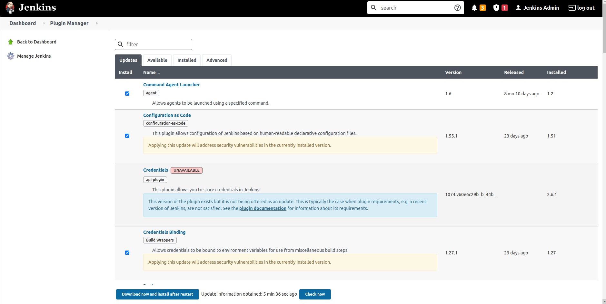
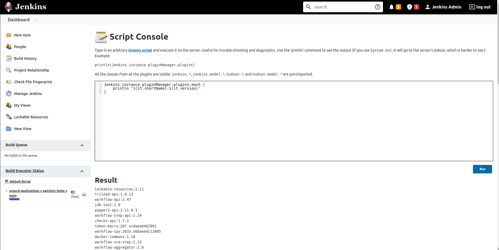

# Developers

This document collects some information about things developers of the gop should know or
problems they might face when they try to run and test their changes.
It provides workarounds or solutions for the given issues.

## Disclaimer

The versions listed in this README may not always reflect the most current release. 
Please be aware that newer versions may exist. 
The versions are also specified in the `Config.groovy` file, so it is recommended to consult that file for the latest version information.


## Table of contents

<!-- Update with `doctoc --notitle docs/developers.md --maxlevel 4`. See https://github.com/thlorenz/doctoc -->
<!-- START doctoc generated TOC please keep comment here to allow auto update -->
<!-- DON'T EDIT THIS SECTION, INSTEAD RE-RUN doctoc TO UPDATE -->

- [Testing](#testing)
  - [Usage](#usage)
  - [Options](#options)
- [Jenkins plugin installation issues](#jenkins-plugin-installation-issues)
  - [Solution](#solution)
  - [Updating all plugins](#updating-all-plugins)
- [Local development](#local-development)
- [Development image](#development-image)
- [Running multiple instances on one machine](#running-multiple-instances-on-one-machine)
  - [Use a different ingress port](#use-a-different-ingress-port)
  - [Access local docker network](#access-local-docker-network)
- [Implicit + explicit dependencies](#implicit--explicit-dependencies)
- [Testing URL separator hyphens](#testing-url-separator-hyphens)
- [External registry for development](#external-registry-for-development)
- [Testing two registries](#testing-two-registries)
  - [Basic test](#basic-test)
  - [Proper test](#proper-test)
- [Testing Network Policies locally](#testing-network-policies-locally)
- [Emulate an airgapped environment](#emulate-an-airgapped-environment)
  - [Setup cluster](#setup-cluster)
  - [Provide images needed by playground](#provide-images-needed-by-playground)
  - [Install the playground](#install-the-playground)
  - [Notifications / E-Mail](#notifications--e-mail)
  - [Troubleshooting](#troubleshooting)
  - [Using ingresses locally](#using-ingresses-locally)
    - [Troubleshooting](#troubleshooting-1)
- [Generate schema.json](#generate-schemajson)
- [Releasing](#releasing)
- [Installing ArgoCD Operator](#installing-argocd-operator)
  - [Prerequisites:](#prerequisites)
  - [Installation Script](#installation-script)
  - [Install ingress manually](#install-ingress-manually)
- [Gitlab (Experimental)](#gitlab-experimental)
  - [Disclaimer](#disclaimer)

<!-- END doctoc generated TOC please keep comment here to allow auto update -->

## Testing

1. There are integration tests implemented by Junit. Classes marked with 'IT' and the end.
2. Long running tests are marked with 'LongIT'.
3. Main Branch executes both, feature-branches only IT.

### Usage
// TODO: laufen die wirklich? (tests sagen wir brauche noch -Dmicronaut.environments=full-prefix, aber selbst damit passiert bei mir lokal nichts)
Runnable separately via maven.
``
mvn failsafe:integration-test -f pom.xml
``
To run long living test, use maven with profile: long-running 
``
mvn failsafe:integration-test -f pom.xml -P long-running
``

### Options
// TODO: Was hat's hiermit auf sich? wer? wie? was? wo?
- `help` - Print this help text and exit
- `url` - The Jenkins-URL to connect to
- `user`- The Jenkins-User for login
- `password` - Jenkins-Password for login
- `fail` - Exit on first build failure
- `interval` - Interval for waits while scanning for builds
- `debug` - Set log level to debug

## Jenkins plugin installation issues

We have had some issues with jenkins plugins in the past due to the installation of the latest versions.
Trying to overcome this issue we pinned all plugins within `scripts/jenkins/plugins/plugins.txt`.
These pinned plugins get downloaded within the docker build and saved into a folder as `.hpi` files. Later on
when configuring jenkins, we upload all the plugin files with the given version.

Turns out it does not completely circumvent this issue. In some cases jenkins updates these plugins automagically (as it seems) when installing the pinned version fails at first or being installed when resolving dependencies.
This again may lead to a broken jenkins, where some of the automatically updated plugins have changes within their dependencies. These dependencies than again are not updated but pinned and may cause issues.

Since solving this issue may require some additional deep dive into bash scripts we like to get rid of in the future, we decided to give some hints how to easily solve the issue (and keep the plugins list up to date :]) instead of fixing it with tremendous effort.

### Solution

* Determine the plugins that cause the issue
  * inspecting the logs of the jenkins-pod
  * jenkins-ui (http://localhost:9090/manage)


* Fix conflicts by updating the plugins with compatible versions
  * Update all plugin versions via jenkins-ui (http://localhost:9090/pluginManager/) and restart



* Verify the plugin installation
  * Check if jenkins starts up correctly and builds all example pipelines successfully
  * verify installation of all plugins via jenkins-ui (http://localhost:9090/script) executing the following command



```groovy
Jenkins.instance.pluginManager.activePlugins.sort().each {
  println "${it.shortName}:${it.version}"
}
```

* Share and publish your plugin updates
  * Make sure you have updated `plugins.txt` with working versions of the plugins
  * commit and push changes to your feature-branch and submit a pr

Note that `plugins.txt` contains the whole dependency tree, including transitive plugin dependencies.
The bare minimum of plugins that are needed is this:

```shell
docker-workflow # Used in example builds
git # Used in example builds
junit # Used in example builds
pipeline-utility-steps # Used in example builds, by gitops-build-lib
pipeline-stage-view # Only necessary for better visualization of the builds
prometheus # Necessary to fill Jenkins dashboard in Grafana
scm-manager # Used in example builds
workflow-aggregator # Pipelines plugin, used in example builds
```

Note that, when running locally we also need `kubernetes` and `configuration-as-code` but these are contained in [our 
jenkins helm image](https://github.com/cloudogu/jenkins-helm-image/blob/5.8.1-1/Dockerfile#L2) (extracted from the 
[corresponding helm chart version](https://github.com/jenkinsci/helm-charts/blob/jenkins-5.8.1/charts/jenkins/values.yaml#L406-L409)).


### Updating all plugins 
To get a minimal list of plugins, start an empty jenkins that uses [the base image of our image](https://github.com/cloudogu/jenkins-helm-image/blob/main/Dockerfile):

```shell
docker run --rm -v $RANDOM-tmp-jenkins:/var/jenkins_home  jenkins/jenkins:2.479.2-jdk17
```
We need a volume to persist the plugins when jenkins restarts.  
(These can be cleaned up afterwards like so: `docker volume ls -q | grep jenkins | xargs -I {} docker volume rm {}`).

Then
* manually install the bare minimum of plugins mentioned above
* extract the plugins using the groovy console as mentioned above
* Write the output into `plugins.txt`

We should automate this!

## Local development

* Run locally
// TODO: welche Dependencies haben wir? 
  * Run from IDE (allows for easy debugging), works e.g. with IntelliJ IDEA
    Note: If you encounter `error=2, No such file or directory`,
    it might be necessary to explicitly set your `PATH` in Run Configuration's Environment Section.
  * From shell:  
    Run
      ```shell
    ./mvnw package -DskipTests
      java -classpath target/gitops-playground-cli-0.1.jar \
        org.codehaus.groovy.tools.GroovyStarter \
        --main groovy.ui.GroovyMain \
        -classpath src/main/groovy \
        src/main/groovy/com/cloudogu/gitops/cli/GitopsPlaygroundCliMain.groovy \
        <yourParamsHere>
       ```
* Running inside the container:
  * Build and run dev Container:
    ```shell
    docker build -t gitops-playground:dev --build-arg ENV=dev --progress=plain --pull .
    docker run --rm -it -u $(id -u) -v ~/.config/k3d/kubeconfig-gitops-playground.yaml:/home/.kube/config \
      --net=host gitops-playground:dev #params
     ```
  * Hint: You can speed up the process by installing the Jenkins plugins from your filesystem, instead of from the internet.  
    To do so, download the plugins into a folder, then set this folder vie env var:  
    `JENKINS_PLUGIN_FOLDER=$(pwd) java -classpath .. # See above`.  
    A working combination of plugins be extracted from the image:
      ```bash
      id=$(docker create --pull=always ghcr.io/cloudogu/gitops-playground:main)
      docker cp $id:/gitops/jenkins-plugins .
      docker rm -v $id
      ```

## Development image

An image containing groovy and the JDK for developing inside a container or cluster is provided for all image version
with a `-dev` suffix.

e.g.
* ghcr.io/cloudogu/gitops-playground:dev
* ghcr.io/cloudogu/gitops-playground:latest-dev
* ghcr.io/cloudogu/gitops-playground:d67ec33-dev

It can be built like so:

```shell
docker build -t gitops-playground:dev --build-arg ENV=dev --progress=plain . 
```

If you're running the dev image and want to try some changes in groovy instantly you can do the following:

```shell
docker run --rm -it  -u $(id -u) \
    -v ~/.config/k3d/kubeconfig-gitops-playground.yaml:/home/.kube/config \
    --net=host --entrypoint bash \
     ghcr.io/cloudogu/gitops-playground:dev
 # do your changes in src/main/groovy
scripts/apply-ng.sh #params
```
// TODO: Ich wuerde mir ueberlegen ob wir damit werben wollen, sehe wenig mehrwert

## Running multiple instances on one machine

Sometimes it makes sense to run more than one instance on your developer machine.
For example, you might want to conduct multiple long-running tests in parallel, or 
you might be interested to see how the latest stable version behaved in comparison to you local build.

You have to options to do this

1. Use a different ingress port
2. Access local docker network (linux only)

### Use a different ingress port

```bash
INSTANCE=2

scripts/init-cluster.sh --bind-ingress-port="808$INSTANCE" \
  --cluster-name="gitops-playground$INSTANCE" --bind-registry-port="3000$INSTANCE"

docker run --rm -t -u $(id -u) \
 -v "$HOME/.config/k3d/kubeconfig-gitops-playground$INSTANCE.yaml:/home/.kube/config" \
    --net=host \
    ghcr.io/cloudogu/gitops-playground --yes --internal-registry-port="3000$INSTANCE" -x \
      --base-url="http://localhost:808$INSTANCE" --argocd --ingress

echo "Once Argo CD has deployed the traefik-ingress. you cn reach your instance at http://scmm.localhost:808$INSTANCE for example"
```

### Access local docker network

This will work on linux only

```bash
INSTANCE=3

scripts/init-cluster.sh \
  --cluster-name="gitops-playground$INSTANCE" --bind-ingress-port=- --bind-registry-port="3000$INSTANCE " 

docker run --rm -t -u $(id -u) \
 -v "$HOME/.config/k3d/kubeconfig-gitops-playground$INSTANCE.yaml:/home/.kube/config" \
    --net=host \
    ghcr.io/cloudogu/gitops-playground --yes --internal-registry-port="3000$INSTANCE" -x --argocd 

xdg-open "http://$(docker inspect -f '{{range .NetworkSettings.Networks}}{{.IPAddress}}{{end}}'  k3d-playground$INSTANCE-server-0):9091"
```

## Implicit + explicit dependencies

The GitOps Playground comprises a lot of software components. The versions of some of them are pinned within this
repository so need to be upgraded regularly.

* Kubernetes [in Terraform](../terraform/vars.tf) and locally [k3d](../scripts/init-cluster.sh),
* [k3d](../scripts/init-cluster.sh)
* [Groovy libs](../pom.xml) + [Maven](../.mvn/wrapper/maven-wrapper.properties)
* Installed components, most versions are maintained in [Config.groovy](../src/main/groovy/com/cloudogu/gitops/config/Config.groovy)
// TODO: what? ein pod 'tmp=docker-gid-grepper' ist eine abhaengigkeit? was soll mir das sagen?
  * Jenkins
    * Helm Chart
    * Plugins
    * Pod `tmp-docker-gid-grepper`
    * `dockerClientVersion`
    * Init container `create-agent-working-dir`
    * Agent Image
  * SCM-Manager Helm Chart + Plugins
  * Docker Registry Helm Chart
  * ArgoCD Helm Chart
  * Grafana + Prometheus Helm Charts
  * Vault + ExternalSerets Operator Helm Charts
  * Ingress Helm Charts
  * Cert-Manager
  * Mailhog
* Applications
  * GitOps-build-lib + `buildImages`
  * ces-build-lib
  * Spring PetClinic
  * Traefik Helm Chart
// TODO: ha? fuer das Dockerfile brauche ich alpine? oder ist Alpine das base image? warum wird das hier aufgefuehrt, aber nicht die benotigte Java version?
* Dockerfile
  * Alpine
  * JDK
  * Groovy
  * musl & zlib
  * Packages installed using apk, gu, microdnf


## Testing URL separator hyphens
// TODO: what? jetzt testen wir URL-features? worum geht's hier eigentlich
```bash
docker run --rm -t  -u $(id -u) \
    -v ~/.config/k3d/kubeconfig-gitops-playground.yaml:/home/.kube/config \
    -v $(pwd)/gitops-playground.yaml:/config/gitops-playground.yaml \
    --net=host \
   gitops-playground:dev --yes --argocd --base-url=http://localhost  --ingress --mail --monitoring --vault=dev --url-separator-hyphen

# Create localhost entries with hyphens
echo 127.0.0.1 $(kubectl get ingress -A  -o jsonpath='{.items[*].spec.rules[*].host}') | sudo tee -a /etc/hosts

# Produce clickable links:
kubectl get --all-namespaces ingress -o json 2> /dev/null | jq -r '.items[] | .spec.rules[] | .host as $host | .http.paths[] | ( "http://" + $host + .path )' | sort | grep -v ^/
```

## External registry for development
// TODO: hier koennte man erwaehnen, das man nicht auf harbor angewiesen ist, sondern jede beliebige Image registry nehmen
// koennte, wir uns aber fuer harbor entschieden haben.

If you need to emulate an "external", private registry with credentials, use the following.

Write this `harbor-values.yaml`:

```yaml
expose:
  type: nodePort
  nodePort:
    ports:
      http:
        # docker login localhost:$nodePort -u admin -p Harbor12345
        # Web UI: http://localhost:nodePort
        # !! When changing here, also change externalURL !!
        nodePort: 30002

  tls:
    enabled: false

externalURL: http://localhost:30002

internalTLS:
  enabled: false

# Needs less resources but forces you to push images on every restart
#persistence:
#enabled: false

chartMuseum:
  enabled: false

clair:
  enabled: false

trivy:
  enabled: false

notary:
  enabled: false
```

Then install it like so:
```bash
helm repo add harbor https://helm.goharbor.io
helm upgrade -i my-harbor harbor/harbor -f harbor-values.yaml --version 1.14.2 --namespace harbor --create-namespace
```
Once it's up and running either create your own private project or just set the existing `library` to private:
```bash
curl -X PUT -u admin:Harbor12345 'http://localhost:30002/api/v2.0/projects/1'  -H 'Content-Type: application/json' \
--data-raw '{"metadata":{"public":"false", "id":1,"project_id":1}}'
```

Then either import external images like so (requires `skopeo` but no prior pulling or insecure config necessary):
```bash
skopeo copy docker://bitnamilegacy/nginx:1.25.1 --dest-creds admin:Harbor12345 --dest-tls-verify=false  docker://localhost:30002/library/nginx:1.25.1
```

Alternatively, you could push existing images from your docker daemon.
However, this takes longer (pull first) and you'll have to make sure to add `localhost:30002` to `insecure-registries` in `/etc/docker/daemon.json` and restart your docker daemon first.

```bash
docker login localhost:30002 -u admin -p Harbor12345
docker tag bitnamilegacy/nginx:1.25.1 localhost:30002/library/nginx:1.25.1
docker push localhost:30002/library/nginx:1.25.1
```

To make the registry credentials know to kubernetes, apply the following to *each* namespace where they are needed:

```bash
kubectl create secret docker-registry regcred \
--docker-server=localhost:30002 \
--docker-username=admin \
--docker-password=Harbor12345
kubectl patch serviceaccount default -p '{"imagePullSecrets": [{"name": "regcred"}]}'
```

This will work for all pods that don't use their own ServiceAccount.
That is, for most helm charts, you'll need to set an individual value.

## Testing two registries

### Basic test
// TODO: das setzt voraus, das ich den kram von oben durchgefuehrt habe, oder?
* Start playground once,
* then again with these parameters:  
  `--registry-url=localhost:30000 --registry-proxy-url=localhost:30000 --registry-proxy-username=Proxy --registry-proxy-password=Proxy12345`
* The petclinic pipelines should still run

### Proper test

**Some hints before getting started**

* Follow these steps in order
* Important: Harbor has to be set up after initializing the cluster, but before installing GOP.  
  Otherwise GOP deploys its own registry, leading to port conflicts:  
  `Service "harbor" is invalid: spec.ports[0].nodePort: Invalid value: 30000: provided port is already allocated`
* By default, `docker run` relies on the `gitops-playground:dev` image.  
  See [here](#Local-development) how to build it, or change `GOP_IMAGE` bellow to e.g. `ghcr.io/cloudogu/gitops-playground`

**Setup**
// TODO: fuer diese ganzen inline-shell scripts hier wuerde ich make oder just empfehlen, viel angenehmer zu verwenden als 
// hier staendig irgendwas raus zu kopieren oder in der IDE sein zu muessen

* Start cluster and deploy harbor (same setup as [above](#external-registry-for-development), but with Port `30000`)

```shell
scripts/init-cluster.sh
helm repo add harbor https://helm.goharbor.io
helm upgrade -i my-harbor harbor/harbor --version 1.14.2 --namespace harbor --create-namespace  --values - <<EOF
expose:
  type: nodePort
  nodePort:
    ports:
      http:
        nodePort: 30000
  tls:
    enabled: false
externalURL: http://localhost:30000
internalTLS:
  enabled: false
chartMuseum:
  enabled: false
clair:
  enabled: false
trivy:
  enabled: false
notary:
  enabled: false
EOF
```

* Create registries and base image:

```bash
# Hit the API to see when harbor is ready
until curl -s -o /dev/null -w "%{http_code}" http://localhost:30000/api/v2.0/projects | grep -q "200"; do
    echo "Waiting for harbor"
    sleep 1
done

declare -A roles
roles['maintainer']='4'
roles['limited-guest']='5'

operations=("Proxy" "Registry")
readOnlyUser='RegistryRead'

for operation in "${operations[@]}"; do

    # Convert the operation to lowercase for the project name and email
    lower_operation=$(echo "$operation" | tr '[:upper:]' '[:lower:]')
    
    echo "creating project ${lower_operation}"
    projectId=$(curl -is --fail 'http://localhost:30000/api/v2.0/projects' -X POST -u admin:Harbor12345 -H 'Content-Type: application/json' --data-raw "{\"project_name\":\"$lower_operation\",\"metadata\":{\"public\":\"false\"},\"storage_limit\":-1,\"registry_id\":null}" | grep -i 'Location:' | awk '{print $2}' | awk -F '/' '{print $NF}' | tr -d '[:space:]')

    echo creating user ${operation} with PW ${operation}12345
    curl -s  --fail 'http://localhost:30000/api/v2.0/users' -X POST -u admin:Harbor12345 -H 'Content-Type: application/json' --data-raw "{\"username\":\"$operation\",\"email\":\"$operation@example.com\",\"realname\":\"$operation example\",\"password\":\"${operation}12345\",\"comment\":null}"
    
    echo "Adding member ${operation} to project ${lower_operation}; ID=${projectId}"
    curl --fail "http://localhost:30000/api/v2.0/projects/${projectId}/members" -X POST -u admin:Harbor12345 -H 'Content-Type: application/json' --data-raw "{\"role_id\":${roles['maintainer']},\"member_user\":{\"username\":\"$operation\"}}"
done

echo "creating user ${readOnlyUser} with PW ${readOnlyUser}12345"
curl -s  --fail 'http://localhost:30000/api/v2.0/users' -X POST -u admin:Harbor12345 -H 'Content-Type: application/json' --data-raw "{\"username\":\"$readOnlyUser\",\"email\":\"$readOnlyUser@example.com\",\"realname\":\"$readOnlyUser example\",\"password\":\"${readOnlyUser}12345\",\"comment\":null}"
echo "Adding member ${readOnlyUser} to project proxy; ID=${projectId}"
curl  --fail "http://localhost:30000/api/v2.0/projects/${projectId}/members" -X POST -u admin:Harbor12345 -H 'Content-Type: application/json' --data-raw "{\"role_id\":${roles['limited-guest']},\"member_user\":{\"username\":\"${readOnlyUser}\"}}"

# When updating the container image versions note that all images of a chart are listed at artifact hub on the right hand side under "Containers Images"
skopeo copy docker://ghcr.io/cloudogu/mailhog:v1.0.1 --dest-creds Proxy:Proxy12345 --dest-tls-verify=false  docker://localhost:30000/proxy/mailhog
skopeo copy docker://ghcr.io/external-secrets/external-secrets:v0.9.16 --dest-creds Proxy:Proxy12345 --dest-tls-verify=false  docker://localhost:30000/proxy/external-secrets
skopeo copy docker://hashicorp/vault:1.14.0 --dest-creds Proxy:Proxy12345 --dest-tls-verify=false  docker://localhost:30000/proxy/vault
skopeo copy docker://bitnamilegacy/nginx:1.23.3-debian-11-r8 --dest-creds Proxy:Proxy12345 --dest-tls-verify=false  docker://localhost:30000/proxy/nginx
skopeo copy docker://docker.io/library/traefik:v3.3.3 --dest-creds Proxy:Proxy12345 --dest-tls-verify=false docker://localhost:30000/proxy/traefik

# Monitoring
// TODO: hier scheint irgendwie etwas Text abhanden gekommen zu sein
# Using latest will lead to failure with
# k describe prometheus -n monitoring
#  Message:               initializing PrometheusRules failed: failed to parse version: Invalid character(s) found in major number "0latest"
skopeo copy docker://quay.io/prometheus/prometheus:v3.8.0 --dest-creds Proxy:Proxy12345 --dest-tls-verify=false docker://localhost:30000/proxy/prometheus
skopeo copy docker://quay.io/prometheus-operator/prometheus-operator:v0.87.1 --dest-creds Proxy:Proxy12345 --dest-tls-verify=false docker://localhost:30000/proxy/prometheus-operator
skopeo copy docker://quay.io/prometheus-operator/prometheus-config-reloader:v0.87.1 --dest-creds Proxy:Proxy12345 --dest-tls-verify=false docker://localhost:30000/proxy/prometheus-config-reloader
skopeo copy docker://docker.io/grafana/grafana:12.3.0 --dest-creds Proxy:Proxy12345 --dest-tls-verify=false docker://localhost:30000/proxy/grafana
skopeo copy docker://quay.io/kiwigrid/k8s-sidecar:2.1.2 --dest-creds Proxy:Proxy12345 --dest-tls-verify=false docker://localhost:30000/proxy/k8s-sidecar

# Cert Manager images
skopeo copy docker://quay.io/jetstack/cert-manager-controller:v1.16.1 --dest-creds Proxy:Proxy12345 --dest-tls-verify=false docker://localhost:30000/proxy/cert-manager-controller
skopeo copy docker://quay.io/jetstack/cert-manager-cainjector:v1.16.1 --dest-creds Proxy:Proxy12345 --dest-tls-verify=false docker://localhost:30000/proxy/cert-manager-cainjector
skopeo copy docker://quay.io/jetstack/cert-manager-webhook:v1.16.1 --dest-creds Proxy:Proxy12345 --dest-tls-verify=false docker://localhost:30000/proxy/cert-manager-webhook

# Needed for the builds to work with proxy-registry
skopeo copy docker://bitnamilegacy/kubectl:1.29 --dest-creds Proxy:Proxy12345 --dest-tls-verify=false  docker://localhost:30000/proxy/bitnami/kubectl:1.29
skopeo copy docker://eclipse-temurin:17-jre-alpine --dest-creds Proxy:Proxy12345 --dest-tls-verify=false  docker://localhost:30000/proxy/eclipse-temurin:17-jre-alpine
skopeo copy docker://ghcr.io/cloudogu/helm:3.16.1-1  --dest-creds Proxy:Proxy12345 --dest-tls-verify=false  docker://localhost:30000/proxy/helm:latest 
skopeo copy docker://maven:3-eclipse-temurin-17-alpine  --dest-creds Proxy:Proxy12345 --dest-tls-verify=false  docker://localhost:30000/proxy/maven:3-eclipse-temurin-17-alpine
skopeo copy docker://cytopia/yamllint:1.25-0.7  --dest-creds Proxy:Proxy12345 --dest-tls-verify=false  docker://localhost:30000/proxy/yamllint:latest 

```
// TODO: hier ueberall muessen die Images kontrolliert werden

* Creating a specific example config file for two registries 
```bash
# Copy content of config.yaml from line one till the last list element under namespaces
awk '1; /example-apps-staging/ {exit}' ../examples/example-apps-via-content-loader/config.yaml > ../scripts/local/two-registries.yaml
# Append following lines to the config file file
cat <<EOF >> ../scripts/local/two-registries.yaml
  variables:
    petclinic:
      baseDomain: "petclinic.localhost"
    nginx:
      baseDomain: "nginx.localhost"
    images:
      kubectl: "localhost:30000/proxy/kubectl:1.29"
      helm: "localhost:30000/proxy/helm:3.16.4-1"
      kubeval: "localhost:30000/proxy/helm:3.16.4-1"
      helmKubeval: "localhost:30000/proxy/helm:3.16.4-1"
      yamllint: "localhost:30000/proxy/cytopia/yamllint:1.25-0.7"
      nginx: ""
      petclinic: "localhost:30000/proxy/eclipse-temurin:17-jre-alpine"
      maven: "localhost:30000/proxy/maven:3-eclipse-temurin-17-alpine"
EOF
```

* Deploy playground:

```bash
# Create a docker container or use an available immage from a registry
# docker build -t gop:dev .
GOP_IMAGE=gop:ingress
PATH_TWO_REGISTRIES=scripts/local/two-registries.yaml #Adjust to path above

docker run --rm -t -u $(id -u) \
   -v ~/.config/k3d/kubeconfig-gitops-playground.yaml:/home/.kube/config \
   -v ${PATH_TWO_REGISTRIES}:/home/two-registries.yaml \
    --net=host \
    ${GOP_IMAGE} -x \
    --yes --argocd --ingress --base-url=http://localhost \
    --vault=dev --monitoring --mail --cert-manager \
    --create-image-pull-secrets \
    --registry-url=localhost:30000 \
    --registry-path=registry \
    --registry-username=Registry \
    --registry-password=Registry12345 \
    --registry-proxy-url=localhost:30000 \
    --registry-proxy-username=Proxy \
    --registry-proxy-password=Proxy12345 \
    --registry-username-read-only=RegistryRead \
    --registry-password-read-only=RegistryRead12345 \
    --mail-image=localhost:30000/proxy/mailhog:latest \
    --vault-image=localhost:30000/proxy/vault:latest \
    --config-file=/home/two-registries.yaml
    
    # Or with config file --config-file=/config/gitops-playground.yaml
```

## Testing Network Policies locally

The first increment of our `--netpols` feature is intended to be used on openshift and with an external Cloudogu Ecosystem.

That's why we need to initialize our local cluster with some netpols for everything to work.
* The `<prefix>-jenkins` ,  `<prefix>-scm-manager` and `<prefix>-registry` namespace needs to be accesible from outside the cluster (so GOP apply via `docker run` has access)
* Emulate OpenShift default netPols: allow network communication inside namespaces and access by ingress controller 

After the cluster is initialized and before GOP is applied, do the following:

```bash
# Prefix handling:
# if used, change prefix to your configured prefix and then
# hyphen "-" is neccessary for this workaorund.
# if no prefix is used, delete everthing after prefix=
prefix=<prefix>-
# When using harbor, do the same for namespace harbor


for ns in ${prefix}jenkins  ${prefix}registry  ${prefix}scm-manager ${prefix}example-apps-production ${prefix}example-apps-staging ${prefix}monitoring ${prefix}secrets; do
  k create ns $ns -oyaml --dry-run=client | k apply -f-
  k apply --namespace "$ns" -f- <<EOF
kind: NetworkPolicy
apiVersion: networking.k8s.io/v1
metadata:
  name: allow-from-ingress-controller
spec:
  podSelector: {}  
  ingress:
    - from:
        - namespaceSelector:
            matchLabels:
              kubernetes.io/metadata.name: ${prefix}traefik
        - podSelector:
            matchLabels:
              app.kubernetes.io/component: controller
              app.kubernetes.io/instance: traefik
              app.kubernetes.io/name: traefik
---
kind: NetworkPolicy
apiVersion: networking.k8s.io/v1
metadata:
  name: allow-from-same-namespace
  annotations:
    description: Allow connections inside the same namespace
spec:
  podSelector: {}
  ingress:
    - from:
        - podSelector: {}
EOF
done
# Some NS need to be accessible from docker image
for ns in ${prefix}jenkins ${prefix}registry ${prefix}scm-manager; do
  k apply --namespace "$ns" -f- <<EOF
kind: NetworkPolicy
apiVersion: networking.k8s.io/v1
metadata:
  name: allow-all-ingress
spec:
  podSelector: {}
  ingress:
  - {}
EOF
done
```

## Emulate an airgapped environment

Let's set up our local playground to emulate an airgapped env, as some of our customers have.

Note that with approach bellow, the whole k3d cluster is airgapped with one exception: the Jenkins agents can work around this.
To be able to run the `docker` plugin in Jenkins (in a k3d cluster that only provides containerd) we mount the host's
docker socket into the agents.
From there it can start containers which are not airgapped.
So this approach is not suitable to test if the builds use any public images.
One solution could be to apply the `iptables` rule mentioned bellow to `docker0` (not tested).

The approach discussed here is suitable to check if the cluster tries to load anything from the internet,
like images or helm charts.

### Setup cluster

```bash
scripts/init-cluster.sh --cluster-name=airgapped-playground
# Note that at this point the cluster is not yet airgapped

# Get the "nodeport" IP
K3D_NODE=$(docker inspect -f '{{range .NetworkSettings.Networks}}{{.IPAddress}}{{end}}' k3d-airgapped-playground-server-0)
 
# Now init some apps you want to have running (e.g. harbor) before going airgapped
helm upgrade  -i my-harbor harbor/harbor -f harbor-values.yaml --version 1.12.2 --namespace harbor --set externalURL=http://$K3D_NODE:30002 --create-namespace
```

Keep kubectl working when airgapped by setting the local IP of the container inside kubeconfig in `~/.config/k3d/...`
```bash
sed -i -r "s/0.0.0.0([^0-9]+[0-9]*|\$)/${K3D_NODE}:6443/g" ~/.config/k3d/kubeconfig-airgapped-playground.yaml
```
You can switch to the airgapped context in your current shell like so:
```shell
export KUBECONFIG=$HOME/.config/k3d/kubeconfig-airgapped-playground.yaml
```

TODO also replace in `~/.kube/config` for more convenience.
In there, we need to be more careful, because there are other contexts. This makes it more difficult.

### Provide images needed by playground

First, let's import necessary images into harbor using `skopeo`.
With `skopeo`, this process is much easier than with `docker` because we don't need to pull the images first.
You can get a list of images from a running playground that is not airgapped.

```bash
# Add more images here, if you like
# We're not adding registry, scmm, jenkins and argocd here, because we have to install them before we go offline (see bellow for details).
IMAGE_PATTERNS=('external-secrets' \
  'vault' \
  'prometheus' \
  'grafana' \
  'sidecar' \
  'traefik')
BASIC_SRC_IMAGES=$(
  kubectl get pods --all-namespaces -o jsonpath="{range .items[*]}{range .spec.containers[*]}{'\n'}{.image}{end}{end}" \
  | grep -Ff <(printf "%s\n" "${IMAGE_PATTERNS[@]}") \
  | sed 's/docker\.io\///g' | sort | uniq)
BASIC_DST_IMAGES=''

# Switch context to airgapped cluster here, e.g.
export KUBECONFIG=$HOME/.config/k3d/kubeconfig-airgapped-playground.yaml

while IFS= read -r image; do
  local dstImage=$K3D_NODE:30002/library/${image##*/}
  echo pushing image $image to $dstImage
  skopeo copy docker://$image --dest-creds admin:Harbor12345 --dest-tls-verify=false  docker://$dstImage
  BASIC_DST_IMAGES+="${dstImage}\n"
done <<< "$BASIC_SRC_IMAGES"
echo $BASIC_DST_IMAGES
```

Note that we're using harbor here, because `k3d image import -c airgapped-playground $(echo $BASIC_IMAGES)` does not
help because some pods follow the policy of always pulling the images.

Note that even though the images are named `$K3D_NODE:30002/library/...`, these are available via `localhost:30002/library/...` in the k3d cluster.

### Install the playground

Don't disconnect from the internet yet, because

* k3d needs some images itself, e.g. the `local-path-provisioner` (see Troubleshooting) which are only pulled on demand.
  In this case when the first PVC gets provisioned.
* SCMM needs to download the plugins from the internet
* Helm repo updates need access to the internet
* But also because we would have to replace the images for registry, scmm, jenkins (several images!) and argocd in the
  source code, as there are no parameters to do so.

So, start the installation and once Argo CD is running, go offline.
```bash
docker run -it -u $(id -u) \
    -v ~/.config/k3d/kubeconfig-airgapped-playground.yaml:/home/.kube/config \
    --net=host gitops-playground:dev --argocd --yes -x \
      --vault=dev --metrics \
      --grafana-image localhost:30002/library/grafana:12.3.0 \
      --grafana-sidecar-image localhost:30002/library/k8s-sidecar:2.1.2 \
      --prometheus-image localhost:30002/library/prometheus:v3.8.0 \
      --prometheus-operator-image localhost:30002/library/prometheus-operator:v0.87.1 \
      --prometheus-config-reloader-image localhost:30002/library/prometheus-config-reloader:v0.87.1 \
      --external-secrets-image localhost:30002/library/external-secrets:v0.6.1 \
      --external-secrets-certcontroller-image localhost:30002/library/external-secrets:v0.6.1 \
      --external-secrets-webhook-image localhost:30002/library/external-secrets:v0.6.1 \
      --vault-image localhost:30002/library/vault:1.12.0 \
      --ingress-image localhost:30002/library/traefik:3.6.7
```

In a different shell start this script, that waits for Argo CD and then goes offline.

```bash
sudo id # cache sudo PW
while true; do
    pods=$(kubectl get pods -n argocd -o jsonpath="{range .items[*]}{.status.phase}{'\n'}{end}")
    # Dont stop when there are no pods
    [[ "$(kubectl get pods  -n argocd --output name | wc -l)" -gt 0 ]] && ready="True" || ready="False" 
    while IFS= read -r pod; do
        if [[ "$pod" != "Running" ]]; then
            ready="False"
        fi
    done <<< "$pods"
    if [[ "$ready" == "True" ]]; then
        break
    fi
    echo "$(date '+%Y-%m-%d %H:%M:%S'): Waiting for ArgoCD pods to be ready. Status: $pods"
    sleep 5
done

echo "$(date '+%Y-%m-%d %H:%M:%S'): Argo CD Ready, going offline"
sudo iptables -I FORWARD -j DROP -i $(ip -o -4 addr show | awk -v ip="$(docker inspect -f '{{range .NetworkSettings.Networks}}{{.Gateway}}{{end}}' k3d-airgapped-playground-server-0)" '$4 ~ ip {print $2}')
```

If you want to go online again, use `-D`
```bash
sudo iptables -D FORWARD -j DROP -i $(ip -o -4 addr show | awk -v ip="$(docker inspect -f '{{range .NetworkSettings.Networks}}{{.Gateway}}{{end}}' k3d-airgapped-playground-server-0)" '$4 ~ ip {print $2}')
```

### Notifications / E-Mail

Notifications are implemented via Mail.  
Either internal MailHog or an external mail server can be used.

To test with an external mail server, set up the configuration as follows:

```
--argocd --monitoring \
--smtp-address <smtp.server.address> --smtp-port <port> --smtp-user <login-username> --smtp-password 'your-secret' \
--grafana-email-to recipient@example.com --argocd-email-to-user recipient@example.com --argocd-email-to-admin recipient@example.com --argocd-email-from sender@example.com --grafana-email-from sender@example.com 
```

For testing, an email can be sent via the Grafana UI.  
Go to Alerting > Notifications, here at contact Points click on the right side at provisioned email contact on "View contact point"   
Here you can check if the configuration is implemented correctly and fire up a Testmail.

For testing Argo CD, just uncomment some of the defaultTriggers in it's values.yaml and it will send a lot of emails.

### Troubleshooting

When stuck in `Pending` this might be due to volumes not being provisioned
```bash
k get pod -n kube-system
NAME                                                         READY   STATUS             RESTARTS      AGE
helper-pod-create-pvc-a3d2db89-5662-43c7-a945-22db6f52916d   0/1     ImagePullBackOff   0             72s
```

### Using ingresses locally

For testing (or because it's more convenient than remembering node ports) ingresses can be used.
For that, k3d provides its own ingress controller traefik.
// TODO: auch hier muss nochmal sichergestellt werden, dass nur korrekte parameter verwendet werden. z.B. nginx faellt hier 
// direkt auf

```bash
docker run --rm -it -u $(id -u) \
  -v ~/.config/k3d/kubeconfig-gitops-playground.yaml:/home/.kube/config \
  --net=host \
  gitops-playground:dev --argocd --monitoring --vault=dev -x --yes \
  --argocd-url argocd.localhost --grafana-url grafana.localhost --vault-url vault.localhost \
  --mail-url mail.localhost --petclinic-base-domain petclinic.localhost \
  --nginx-base-domain nginx.localhost
```

Once Jenkins and Argo CD are through with their initial steps you can conveniently get all ingresses via

```shell
$ kubectl get ingress -A
NAMESPACE                 NAME                            CLASS     HOSTS                                                          ADDRESS                                                PORTS   AGE
argocd                    argocd-server                   traefik   argocd.localhost                                 192.168.178.42,2001:e1:1234:1234:1234:1234:1234:1234   80      14m
# ...
```

Where opening for example http://argocd.localhost in your browser should work.

The `base-domain` parameters lead to URLs in the following schema:  
`<stage>.<app-name>.<parameter>`, e.g.  
`staging.nginx-helm.nginx.localhost`

#### Troubleshooting

When requests are denied, there might be problems with the iptables/nftables config on your host.
Using nft insert, to make sure the rule is on top.
// TODO: dieser Befehl oeffnet port 80 global!  
```
nft insert rule ip filter INPUT tcp dport 80 accept
```

## Generate schema.json


Run `GenerateJsonSchema.groovy` from your IDE.

Or run build and run via maven and java:

````shell
mvn package -DskipTests
java -classpath target/gitops-playground-cli-0.1.jar org.codehaus.groovy.tools.GroovyStarter --main groovy.ui.GroovyMain \
  --classpath src/main/groovy src/main/groovy/com/cloudogu/gitops/cli/GenerateJsonSchema.groovy
````

Or build and run the via docker:

```shell
docker build -t gitops-playground:dev --build-arg ENV=dev  --progress=plain .
docker run --rm --entrypoint java gitops-playground:dev -classpath /app/gitops-playground.jar \
 org.codehaus.groovy.tools.GroovyStarter --main groovy.ui.GroovyMain \
 --classpath /app/src/main/groovy /app/src/main/groovy/com/cloudogu/gitops/cli/GenerateJsonSchema.groovy - \
 > docs/configuration.schema.json
```

## Releasing

On `main` branch:

````shell
TAG=0.5.0

// TODO: was sollen die [[ hier?
git checkout main
[[ $? -eq 0 ]] && git pull
[[ $? -eq 0 ]] && git tag -s $TAG -m $TAG
[[ $? -eq 0 ]] && git push --follow-tags

[[ $? -eq 0 ]] && xdg-open https://ecosystem.cloudogu.com/jenkins/job/cloudogu-github/job/gitops-playground/job/main/build?delay=0sec
````

For now, please start a Jenkins Build of `main` manually.  
We might introduce tag builds in our Jenkins organization at a later stage.

A GitHub release containing all merged PRs since the last release is create automatically via a [GitHub action](../.github/workflows/create-release.yml)

## Installing ArgoCD Operator

This guide provides instructions for developers to install the ArgoCD Operator locally.

### Prerequisites:

Ensure you have the following installed on your system:

- Git: For cloning the repository. 
- golang: Version >= 1.24

### Installation Script

Copy the following script, paste it into your Terminal and execute it.

```shell
git clone https://github.com/argoproj-labs/argocd-operator && \
cd argocd-operator && \
git checkout release-0.16 && \
make deploy IMG=quay.io/argoprojlabs/argocd-operator:v0.15.0
```

### Install ingress manually

The ArgoCD installed via Operator is namespace isolated and therefor can not deploy an ingress-controller, because of global scoped configurations.
GOP has to be startet with ``` --insecure ``` because of we do not use https locally.
We have to install the ingress-controller manually:


```shell
// TODO: was soll das cat hier?
cat <<'EOF' | helm upgrade --install traefik traefik/traefik \
  --version 4.12.1 \
  --namespace traefik \
  --create-namespace \
  -f -  
  
EOF
```

If the helm repos are not present or up-to-date:

```shell
helm repo add traefik https://traefik.github.io/charts
helm repo update
helm install traefik traefik/traefik --version 39.0.0
```
