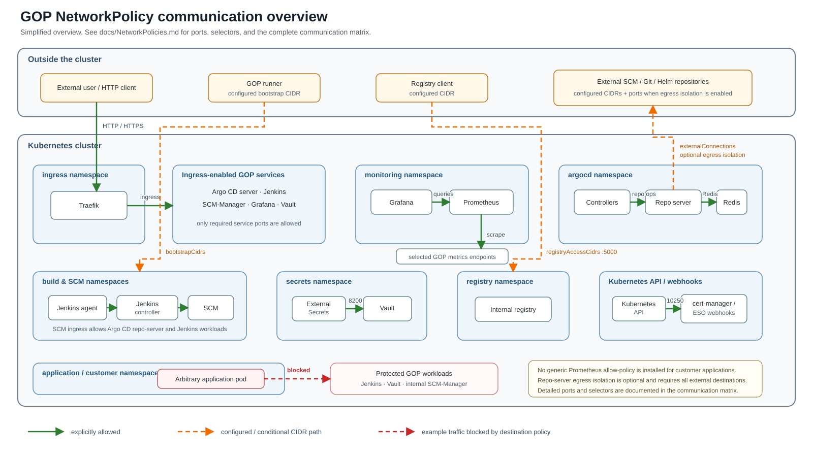

# NetworkPolicy communication model

The GitOps Playground (GOP) uses Kubernetes NetworkPolicies to restrict ingress to bundled platform components to the communication paths they actually require. The policies are generated from GOP configuration and are intended to provide a portable least-privilege baseline without depending on CNI-specific extensions.

The diagram below shows the most important allowed and denied communication paths. It is intentionally focused on GOP-managed workloads; application/customer namespaces are not globally isolated by GOP.



[Editable draw.io source](images/network-policies.drawio)

## Legend

- **Green solid arrow**: communication explicitly allowed by a GOP-managed NetworkPolicy.
- **Orange dashed arrow**: environment-dependent access that is only available when the corresponding CIDR configuration is present.
- **Red dashed arrow**: example traffic rejected because the destination workload is ingress-isolated and the source is not part of its allow-list.

## Implemented communication paths

| Source | Destination | Purpose | NetworkPolicy behavior |
| --- | --- | --- | --- |
| External client | Traefik | Public HTTP/HTTPS entry point | Traefik exposes only its public `web` and `websecure` ports. |
| Traefik | Argo CD server | Argo CD ingress | Allowed when GOP ingress is enabled. |
| Traefik | Jenkins controller | Jenkins UI/API ingress | Allowed on the Jenkins HTTP port. |
| Traefik | Internal SCM-Manager | SCM web/API ingress | Allowed on the SCM HTTP port. |
| Traefik | Grafana | Grafana ingress | Allowed on the Grafana port. |
| Traefik | Vault | Vault UI/API ingress | Allowed on TCP/8200 when Vault ingress is configured. |
| Prometheus | GOP metrics endpoints | Metrics scraping | Each monitored GOP workload explicitly allows Prometheus on its metrics endpoint. |
| Grafana | Prometheus | Dashboard data queries | Prometheus allows Grafana on its HTTP endpoint. |
| Argo CD components | Argo CD repo-server | Manifest/repository operations | Repo-server ingress is restricted to the Argo CD components that require it. |
| Argo CD repo-server | Argo CD Redis | Internal Argo CD dependency | Redis access is preserved when repo-server egress isolation is enabled. |
| Argo CD repo-server | Internal SCM-Manager | Git repository access | SCM-Manager explicitly allows the repo-server. |
| Jenkins controller / agents | Internal SCM-Manager | Git/SCM access | SCM-Manager explicitly allows Jenkins workloads. |
| Jenkins agents | Jenkins controller | Agent/controller communication | Jenkins allows its own agents on the required controller ports. |
| External Secrets | Vault | Secret retrieval | Vault allows External Secrets on TCP/8200. |
| Kubernetes API server | cert-manager webhook | Admission webhook | The webhook port TCP/10250 is allowed; the API server cannot be represented by a portable pod selector. |
| Kubernetes API server | External Secrets webhook | Admission/conversion webhook | The webhook port TCP/10250 is allowed for the same reason. |
| Configured bootstrap CIDR | Jenkins / internal SCM-Manager | Initial setup and repeated GOP runs from outside the cluster | Allowed only for configured `bootstrapCidrs`. |
| Configured registry CIDR | Internal registry | Image push/pull access | Allowed only for configured `registryAccessCidrs` on TCP/5000. |
| Argo CD repo-server | External SCM/Git/Helm endpoint | Optional restricted external repository access | CIDR/port rules are generated from `externalConnections` when repo-server egress isolation is explicitly enabled. |

## Explicit least-privilege exceptions

Some Kubernetes control-plane communication cannot be restricted to a portable pod or namespace selector.

The Kubernetes API server needs to reach admission and conversion webhooks such as the cert-manager and External Secrets webhooks. Standard Kubernetes NetworkPolicies do not provide a portable selector that identifies the API server across Kubernetes, OpenShift and other supported environments.

For these webhook paths, GOP therefore restricts ingress to the required webhook port TCP/10250, but does not restrict the source of the connection.

This is an explicit portability trade-off. Environments that require stricter control-plane filtering need environment-specific restrictions, for example based on control-plane CIDRs.

## Application and customer namespaces

GOP no longer creates a generic `allow-prometheus-scraping` NetworkPolicy in application/customer namespaces. Monitoring access is owned by the GOP workloads that are actually scraped instead of being distributed as a broad policy to every known namespace.

This does **not** mean that GOP installs a default-deny policy for arbitrary customer applications. If an application namespace requires its own ingress or egress isolation, that policy remains the responsibility of the application/platform configuration for that namespace.

Because Jenkins, Vault and internal SCM-Manager are themselves ingress-isolated, an arbitrary application pod is not allowed to connect directly to those workloads unless an explicit allow rule is added.

## External connections and egress isolation

Environment-specific external access is configured below `application.networkPolicies` rather than being hard-coded into the GOP templates. The currently implemented generic `externalConnections` use case is Argo CD repo-server egress.

```yaml
application:
  networkPolicies:
    egressIsolation: true
    externalConnections:
      - name: external-scm-manager
        tool: argocd-repo-server
        direction: egress
        cidrs:
          - 203.0.113.10/32
        ports:
          - protocol: TCP
            port: 443
```

`egressIsolation` is deliberately disabled by default. A configured `externalConnections` entry does not restrict traffic by itself while isolation is disabled.

When `egressIsolation: true` is enabled, the Argo CD repo-server becomes egress-isolated. GOP automatically preserves DNS and the repo-server-to-Redis dependency, but **all external SCM, Git and Helm destinations required by the repo-server must be explicitly configured**. Missing destinations will fail during repository or Helm chart refreshes.

Standard Kubernetes NetworkPolicies work with IP/CIDR ranges, not DNS/FQDN names. External addresses therefore need sufficiently stable CIDRs. NAT, load balancers and the selected CNI can also influence which source or destination IP is evaluated by the policy.

## Local validation

The committed GOP profiles intentionally contain no environment-specific CIDRs. For local k3d testing, copy the example override and fill in the values for the current environment:

```bash
cp scripts/dev/network-policies/netpol-local.example.yaml \
  scripts/dev/network-policies/netpol-local.yaml
```

See [Testing Network Policies locally](Developers.md#testing-network-policies-locally) for the complete local workflow, including bootstrap and external-connection configuration.
