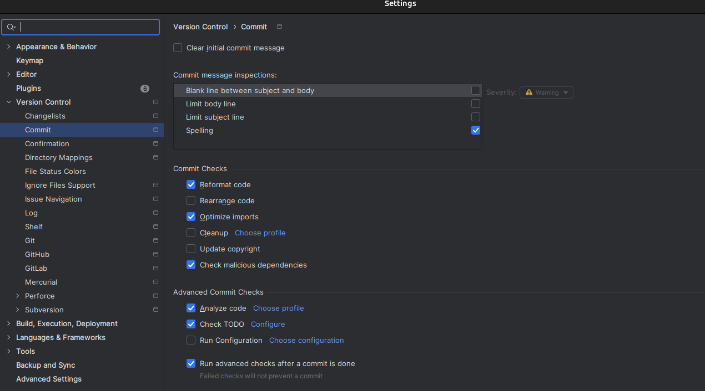
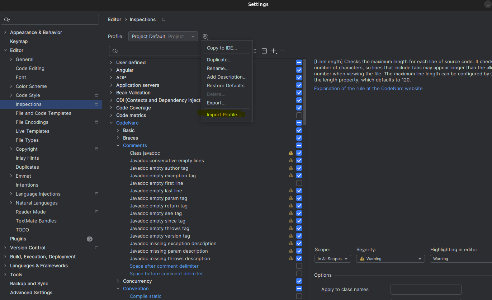

# Code Formatting Guide

When you open a `.editorconfig` file in IntelliJ IDEA for the first time, you'll see an "Enable EditorConfig support"
button at the top of the editor. Simply click this button to activate EditorConfig support.

Alternatively, you can enable it manually:

1. Go to Settings/Preferences
2. Search for "EditorConfig"
3. Check "Enable EditorConfig support"

Once enabled, the project's `.editorconfig` file will be automatically recognized and its rules will be applied to your
code.

## Auto-Format on Commit

To ensure consistent code formatting across the project, you can configure IntelliJ to automatically format code before
committing:

## CodeNarc Inspection Profile

To use custom CodeNarc rules in IntelliJ:

and load Project_Default.xml 