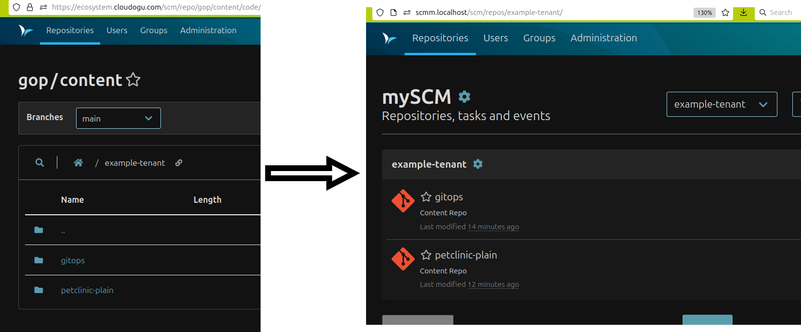

# Content loader Documentation

This documentation shows the content loader feature and its usage. 

Content loader offers the ability of hooking into the GitOps Playground (GOP) installation process, allowing for 
customization of what is pushed to Git.
This can be used to deploy your own content, e.g. your own applications, or adding tenants to Argo CD, etc.  

Example for a GOP content repository:

- Sample [configuration file](content-loader-config.yaml).
- [Directory structure](.) as an example of a folder-based content repository.

# Table of contents
<!-- Update with `doctoc --notitle docs/content-loader/content-loader.md --maxlevel 2`. See https://github.com/thlorenz/doctoc -->
<!-- START doctoc generated TOC please keep comment here to allow auto update -->
<!-- DON'T EDIT THIS SECTION, INSTEAD RE-RUN doctoc TO UPDATE -->

- [Purpose of content loader](#purpose-of-content-loader)
- [Meaning of the term "content"](#meaning-of-the-term-content)
- [Content loader concepts](#content-loader-concepts)
  - [Content repos](#content-repos)
  - [Additional options](#additional-options)
  - [Different types of content repos](#different-types-of-content-repos)
  - [The overrideMode](#the-overridemode)
  - [Templating](#templating)
- [TL;DR](#tldr)
- [Example use cases](#example-use-cases)
  - [Mirror the entire repository on every call](#mirror-the-entire-repository-on-every-call)
  - [Create additional tenant in Argo CD](#create-additional-tenant-in-argo-cd)
  - [Mirror/copy repo and add specific files](#mirrorcopy-repo-and-add-specific-files)

<!-- END doctoc generated TOC please keep comment here to allow auto update -->


# Purpose of content loader

You like the idea of automatically rolling out IDPs using GOP but

* want to initialize it with your own real-world end-user application that is automatically deployed as a turnkey solution,
* want to add multiple tenants with Argo CD,
* want to have different or additional IDP tools, e.g. logging/backup/tracing, etc. 

Then content loader is for you!
It allows you to define content using a folder structure inside a Git repo (so-called content repo) that is picked up
during GOP apply optionally run through a templating engine and then pushed to the target Git.

# Meaning of the term "content"

- Currently, GOP (version > 0.11.0) consists of example applications and exercises and their dependencies, 
  in addition to the actual IDP (ArgoCD, Prometheus, etc.).  
  ➡️ Turnkey-solution deployed via GitOps pipelines
- We refer to these applications as "content".
- When rolling out GOP, the `--content-examples` parameter leads to example applications being pushed to Git.
- These applications include:
  - Code (e.g., repo `argocd/petclinic-helm`)
  - Configuration (Argo CD `Application` and YAML resources in the GitOps repo `argocd/example-tenant`)
  - Basic configuration of the tenant (Argo CD `AppProject` and `Application` of Applications in the repo `argocd/argocd`)
  - Some of them contain Jenkins files that describe how to build and push images and start the GitOps process.
  - Dependencies, e.g., `3rd-party-dependencies/gitops-build-lib` and `3rd-party-dependencies/spring-boot-helm-chart`
  - Jenkins job that clones the repos, builds images, and triggers the GitOps process
- After installing GOP, the example applications are built by Jenkins and deployed by ArgoCD via GitOps.  
  Finally, these end-user applications can be reached via HTTP(S) via their ingress (turnkey-solution).
- The content loader feature provides the possibility to deliver your own custom content, i.e. real-world applications instead of examples.

# Content loader concepts

The content deployed by GOP can be completely defined via configuration.

This allows for 
* changing all Git repos created by GOP. 
* adding new Git repos, e.g. for end-user applications (including their dependencies such as Helm charts or build libraries) as well as IDP applications, such as monitoring tools.

This is done by means of a `content` section within GOP's config file (the one being specified by `--config-file`).

Here is a schematic example of the `content` section that will be described in the following:

```yaml
content:
  repos:
    - url: 'https://...'
      path: 'a/b'
      ref: branch
      templating: true
      type: FOLDER_BASED
      overwriteMode: UPGRADE
      createJenkinsJob: true
    - ...

  namespaces:
    - prod
    - ...

  variables:
    my: value
    another: value
    
  examples: true
```

See [here for a full example](content-loader-config.yaml). 
The [TL;DR](#tldr) sections shows how to see this example in action.

## Content repos
- The content is defined in Git repositories, known as content repos (`content.repos`)
- There are different `type`s of content repos: `MIRROR`, `COPY`, and `FOLDER_BASED` ([see different types of content repos](#different-types-of-content-repos)).
- For these types of content repos, the `overrideMode` determines how to handle previously existing files in the repo: `INIT`, `UPGRADE`, `RESET` ([see overrideMode](#the-overridemode)).
- Templating with [Freemarker](https://freemarker.apache.org/) can be enabled for each content repo.
  - The templates can access the config and custom variables defined in `content.variables`. 
  - See [templating](#templating).
- Multiple content repos can be specified in the `content.repos` field
- GOP merges these repos in the defined order into a directory structure.
- This allows you to overwrite files from all repos created by GOP.
    - One use case for this is, for example, a base repository that specifies the basic structure of all GOP instances in a cloud environment and more specialized repositories that contain specific applications.
    - Another use case is to keep the configuration (YAML) in one repo and the code in another to deploy different config with the same code.  
      Current examples are `petclinic-plain` and `petclinic-helm`.
- Existing repositories, e.g., `argocd/argocd`, can be extended by  `COPY`, and `FOLDER_BASED` content repos.
  - ArgoCD `AppProjects` and `Applications` can be defined in the content.  
  - This also allows you to hook into the configuration of Argo CD and, for example, define different tenants.

## Additional options

- **Kubernetes namespaces** needed for the content (e.g. `example-tenant-staging`) can be specified via the `content.namespaces` field.
    - GOP deploys the namespaces listed therein via GitOps.
    - In each namespace, the configured ImagePullSecrets are automatically generated and RBAC resources and `NetworkPolicies` are set up, which enable Prometheus to access the metrics.
    - This also allows GOP to create `ProjectRequests` instead of `Namespaces` under OpenShift.
    - The list may contain more namespaces than are used in the content.
    - The namespaces allow templating, e.g., `‘${config.application.namePrefix}example-tenant-staging’, ‘${config.application.namePrefix}example-tenant-production’`
- **Jenkins**: Automatic generation of Jenkins jobs based on the content is possible.  
  When enable for a content repo (via `content.repos.createJenkinsJob` set to `true`) a job is created...
    - for each SCM Manager namespace found in the content
    - that contains a `Jenkinsfile`.
- The **example content** (see [README/Example Applications](../../README.md#example-applications)) can be activated via the `content.examples` field.


## Different types of content repos

There are different types of content repos: `MIRROR`, `COPY`, and `FOLDER_BASED`.
- `MIRROR` (default): The entire content repo is mirrored to the target repo if it does not yet exist ([see overrideMode](#the-overridemode)).
- `COPY`: Only the files (no Git history) are copied to the target repository and committed.
- `FOLDER_BASED`: Using the folder structure in the content repository, multiple repositories can be created and initialized or changed in the target.

**Global Properties**

- `url` (required) — url of the content repo
- `ref` - Git reference that is cloned in Content Repo (branch, tag, commit).  
  Defaults:
  - `COPY` / `FOLDER_BASED`: Default branch of Repo.
  - `MIRROR`: All branches und tags of Repo
- `overrideMode` (`INIT`, `UPGRADE`, `RESET`) defines how to handle existing files in the target repository ([see overrideMode](#the-overridemode)).
- `username`, `password` - credentials
- `createJenkinsJob` - If `true` and Jenkins is active in GOP, and there is a `Jenkinsfile` in one of the content repositories or the specified `refs`, a Jenkins job is created for the associated SCM Manager namespace.


### `MIRROR`

A content repo is mirrored completely (or only a `ref`) to the target repo (including Git history).  

Caution: Force push is used here! 
Note that by default only new repos are mirrored.
To overwrite `overrideMode: RESET` must be set ([see overrideMode](#the-overridemode)).

Note: The default branch of the source repo is not explicitly set.
If the source repo has a default branch != `main`, it is not applied.

**Properties**

- `target` (required) - target repo, e.g. `namespace/name`
- `targetRef` - Git reference in `target` to which it is pushed (branch or tag).
  - If `ref `is a tag,` targetRef` is also treated as a tag.
  - Exception:` targetRef` is a full ref such as` refs/heads/my-branch` or `refs/tags/my-tag`.
  - If `targetRef` is empty, the source `ref` is used by default.


### `COPY`

Only the files (no Git history) are copied and committed to the target repo.

**Properties**

- `target` (required) - target repo, e.g. `namespace/name`
- `targetRef` - Git reference in `target` to which is pushed (branch or tag). 
  - If `ref `is a tag, `targetRef` is also treated as a tag.
  - Exception:` targetRef` is a complete `ref `such as `refs/heads/my-branch` or `refs/tags/my-tag`. 
  - If` targetRef` is empty, the source `ref `is used by default.
- `path `- Folder within the content repo from which to copy
- `templating`- If `true`, all `.ftl` files are rendered using [Freemarker](https://freemarker.apache.org/) before being pushed to `target` ([see templating](#templating)).


### `FOLDER_BASED`
- Using the folder structure in the content repository, multiple repositories can be created in the target and initialized or extended using `COPY`.
- That is, The top two directory levels of the repository determine the target repositories in GOP.
- Example: The contents of the `example-tenant/petclinic-plain` folder are pushed to the `gitops` repository in the `example-tenant` namespace.



This allows, for example, additional Argo CD applications to be added and even your own tenants to be deployed.

**Properties**

- `target` (required) - target repo, e.g. `namespace/name`
- `path` - source folder in the content repository used for copying
- `templating` - If `true`, all `.ftl` files are rendered using [Freemarker](https://freemarker.apache.org/) before being pushed to `target` ([see templating](#templating)).

## The overrideMode

For all types of content repos, the `overrideMode` determines how to handle previously existing files in the repo: `INIT`, `UPGRADE`, `RESET`.
- `INIT` (default): Only push if the repository does not exist
- `UPGRADE`: Clone and copy – existing files are overwritten, files that are not in the content are retained.
- `RESET`: Delete all files after cloning the source, then copy new files.
  This results in files that are not in the content being deleted.

**Note**  
With `MIRROR`, `RESET` does not reset the entire repository. Specific effect: Branches that exist in the target but not in the source are retained.

**Important**  
If existing repositories of GOP are to be extended, e.g., `cluster-resources`, the `overrideMode` must be set to `UPGRADE`.

## Templating
When `templating` is enabled, all files ending in `.ftl` are rendered using [Freemarker](https://freemarker.apache.org/) during GOP installation and the result is created under the same name without the `.ftl` extension.

The entire configuration of GOP is available as `config` variable in the templates.

In addition, you can define your own variables (`content.variables`).
This makes it possible to write parameterizable content that can be used for different instances.

In [Freemarker](https://freemarker.apache.org/), you can use static methods from GOP and JDK. 
An [example from GOP code](https://github.com/cloudogu/gitops-playground/blob/0.11.0/applications/cluster-resources/monitoring/prometheus-stack-helm-values.ftl.yaml#L111):

```yaml
<#assign DockerImageParser=statics['com.cloudogu.gitops.utils.DockerImageParser']>
# ...
  <#if config.features.monitoring.helm.prometheusOperatorImage?has_content>
  <#assign operatorImageObject = DockerImageParser.parse(config.features.monitoring.helm.prometheusOperatorImage)>
image:
  registry  : ${operatorImageObject.registry}
  repository: ${operatorImageObject.repository}
  tag       : ${operatorImageObject.tag}
  </#if>
```

# TL;DR

How to get started with content loader?

You can deploy GOP with customized content defined in a config file on a local Kubernetes cluster by running 
a single command:

```shell
bash <(curl -s \
  https://raw.githubusercontent.com/cloudogu/gitops-playground/main/scripts/init-cluster.sh) \
  && curl -s "https://raw.githubusercontent.com/cloudogu/gitops-playground/main/docs/content-loader/content-loader-config.yaml" > contentConfig.yaml \
  && docker run --rm -t --pull=always -u $(id -u) \
    -v ~/.config/k3d/kubeconfig-gitops-playground.yaml:/home/.kube/config \
    -v "$(pwd)/contentConfig.yaml:/app/contentConfig.yaml" \
    --net=host \
    ghcr.io/cloudogu/gitops-playground --config-file=contentConfig.yaml --debug
```

Once GOP is started, you can try the following example use cases.
Most applications mentioned in [README/Example Applications](../../README.md#example-applications) are deployed now.

# Example use cases

This chapter describes real-world use cases that can be done via content loader.

You can try them out by editing `content-loader-config.yaml` created in [TL;DR](#tldr).

## Mirror the entire repository on every call
```yaml
    - url: 'https://github.com/cloudogu/spring-boot-helm-chart'
      target: '3rd-party/spring-boot-helm'
      overrideMode: RESET
```


## Create additional tenant in Argo CD
```yaml
    - url: 'https://github.com/cloudogu/gitops-playground.git'
      path: 'docs/content-loader'
      ref: main
      # username: 'abc' # necessary if git repo requires credentials
      # password: 'ey...' # e.g. API Token from SCM-Manager
      templating: true
      type: FOLDER_BASED
      overrideMode: UPGRADE
```

In this repo, the folder structure is as follows: [argocd/argocd.](argocd/argocd)

## Mirror/copy repo and add specific files

This example first `MIRROR`s a repo, then adds a `Dockerfile` and `Jenkinsfile` and a Jenkins job.

As an alternative you can add type `COPY` in the first repo (petclinic), resulting in only the files not the git history being pushed to `target`.  
Reminder: no type means MIRROR (default).

```yaml
    - url: https://github.com/cloudogu/spring-petclinic
      target: example-tenant/petclinic-plain
      ref: feature/gitops_ready
      targetRef: main
      overrideMode: UPGRADE
      createJenkinsJob: true
    - url: https://github.com/cloudogu/gitops-playground.git
      path: 'docs/content-loader'
      ref: main
      # username: 'abc' # necessary if git repo requires credentials
      # password: 'ey...' # e.g. API Token from SCM-Manager
      templating: true
      type: FOLDER_BASED
      overrideMode: UPGRADE
```

